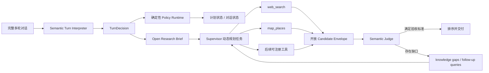

# AI 原生 Agent 与 Deep Research 开放语义重构 v2

> 项目：WhereToGo2  
> 日期：2026-07-29  
> 状态：本轮方案已开始落地  
> 取代：`对话意图理解与DeepResearch重构分析设计_v1.md` 中以领域标签、关键词规则补齐语义覆盖的部分

## 1. 结论

这次“杭州没有自然景点”不是缺少一个“自然景点”枚举，而是架构边界错误。

旧实现把开放的用户语义当成了封闭业务协议：

- `_INTEREST_ALIASES` 枚举用户可能喜欢的活动类型；
- `_FEEDBACK_KINDS` 枚举反馈中可能出现的类型及其候选关键词；
- `_PREFERENCE_SIGNALS` 枚举偏好及其标题信号；
- 未识别兴趣在 `_matches_constraint_kinds()` 中默认匹配所有候选；
- 研究充分性主要统计实体数、证据数和来源数，不验证结果是否满足原始需求；
- 深研抽取模型只接受有日期的 `Activity`，因此常设自然景点、街区、建筑、空间等即使搜到也无法进入候选集。

继续增加“自然景点”“工业遗址”“宠物友好温泉”等词表，只会把同一故障推迟到下一个新表达。

正确边界是：

> 用户目标、体验要求、排除项、研究问题、候选类型和知识缺口是开放文本；工具、权限、副作用、状态转移、预算和停止原因才是有限协议。

AI 原生不等于让模型任意修改系统。它意味着模型负责理解开放语义、制定研究任务、选择工具和反思证据；确定性运行时负责校验、执行、持久化、权限、预算与熔断。

## 2. 本次故障的真实链路

用户表达：

> 我不想去博物馆了，我要去自然景点，给我推荐自然景点。

旧链路发生了以下事情：

1. 对话层只能把模型输出压回 `interests`，并继续经过有限别名词表。
2. 研究层围绕“当周活动”搜索和抽取。
3. 抽取器要求 `start_at`，常设景点无法成为 `Activity`。
4. 20 个来源中只有一个活动型实体入库，但日期不在目标窗口，所以新候选为 0。
5. 上一轮 5 个博物馆候选仍作为 baseline。
6. 质量判断看到“有 5 个实体、有证据、有来源”，可能判断充分，却没有验证它们是否是自然景点。
7. 最终系统把“深研没有产出”错误表述成“杭州没有自然景点”。

这不是搜索引擎没有结果，而是：

> 研究对象模型、语义判断和停止条件共同把正确答案挡在系统之外。

## 3. 开源 Agent / Deep Research 的源码对照

### 3.1 LangChain Open Deep Research

源码中的研究请求是自由文本：

- `ResearchQuestion.research_brief: str`
- `ConductResearch.research_topic: str`

Supervisor 的有限协议是 `ConductResearch`、`ResearchComplete` 和思考工具；研究主题本身不是枚举。模型读取完整消息生成 research brief，再动态拆分并行主题。

源码：

- [deep_researcher.py](https://github.com/langchain-ai/open_deep_research/blob/main/src/open_deep_research/deep_researcher.py)
- [state.py](https://github.com/langchain-ai/open_deep_research/blob/main/src/open_deep_research/state.py)

### 3.2 Google Gemini Fullstack LangGraph Quickstart

实现将用户主题交给模型动态生成 `SearchQueryList`。搜索后由 `Reflection` 输出：

- `is_sufficient`
- `knowledge_gap`
- `follow_up_queries`

它枚举的是结构化控制字段，不枚举用户研究主题。Reflection 对照原始主题和已有摘要识别知识缺口，而不是按结果数量停止。

源码：

- [graph.py](https://github.com/google-gemini/gemini-fullstack-langgraph-quickstart/blob/main/backend/src/agent/graph.py)
- [tools_and_schemas.py](https://github.com/google-gemini/gemini-fullstack-langgraph-quickstart/blob/main/backend/src/agent/tools_and_schemas.py)
- [prompts.py](https://github.com/google-gemini/gemini-fullstack-langgraph-quickstart/blob/main/backend/src/agent/prompts.py)

### 3.3 GPT Researcher

GPT Researcher 先以原始自然语言查询检索，再由模型生成 research outline 和 subqueries。它确实存在 `ReportSource`、`ReportType`、MCP strategy 等枚举，但这些属于基础设施和输出协议，不是“博物馆/自然景点/工业遗址”之类用户主题。

源码：

- [researcher.py](https://github.com/assafelovic/gpt-researcher/blob/master/gpt_researcher/skills/researcher.py)
- [query_processing.py](https://github.com/assafelovic/gpt-researcher/blob/master/gpt_researcher/actions/query_processing.py)

### 3.4 Hugging Face smolagents

smolagents 的边界同样是有限工具集合与开放任务。Agent 可以动态组合工具调用，受最大步骤、计划间隔和最终回答协议控制；任务内容不需要先进入领域分类词表。

源码：

- [Open Deep Research 示例](https://github.com/huggingface/smolagents/blob/main/examples/open_deep_research/run.py)
- [Guided Tour](https://github.com/huggingface/smolagents/blob/main/docs/source/en/guided_tour.md)

### 3.5 对照结论

这些项目不是“完全没有枚举”，而是枚举位置不同：

| 应当有限 | 应当开放 |
|---|---|
| 工具名称与参数 schema | 用户目标 |
| 可执行命令与副作用 | 兴趣、偏好、排除项 |
| 权限、预算、并发、最大轮次 | research brief |
| 生命周期状态与停止原因 | subquery、knowledge gap |
| 数据类型与安全校验 | 候选种类及适配理由 |

WhereToGo2 旧实现的核心问题，是把右列做成了词表，而左列的执行动作又分散在 `intent`、BFF 分支和 LangGraph 状态中。

## 4. 目标架构



### 4.1 Semantic Turn Interpreter

输入：

- 当前消息；
- 最近对话；
- 当前约束；
- 当前阶段；
- 待澄清问题；
- 最近展示的候选和研究状态。

输出的有限部分：

- `acts`
- `commands`
- 对稳定旅行属性的修改操作。

输出的开放部分：

```json
{
  "experience_requirements": [
    "自然环境为主",
    "排除博物馆和室内展馆",
    "适合两人慢慢游览"
  ],
  "research_goal": "为下下周末的杭州情侣行程寻找自然景观",
  "acceptance_criteria": [
    "候选是具体可到访地点",
    "来源能支持其自然景观属性",
    "不是博物馆或室内展馆",
    "开放时间与目标日期不存在已知冲突"
  ]
}
```

`experience_requirements` 的值不做同义词归一和类别映射。新表达直接保留，不需要发布代码。

### 4.2 稳定字段与开放语义的边界

以下字段可以保持类型化，因为它们是产品不变量：

- 出发地、目的地；
- 时间窗口；
- 人数；
- 预算；
- 交通接受条件；
- 订单确认状态。

以下内容不应成为业务 enum：

- 想玩什么；
- 什么氛围；
- 对谁友好；
- 不想看到什么；
- “类似第二个但更安静”等相对偏好；
- 用户下一次才会发明的新需求。

### 4.3 Tool Registry

工具集合有限且带描述，例如：

- `web_search`
- `map_places`
- `query_local_catalog`
- `read_url`
- `verify_candidate`
- `rank_candidates`

模型根据 research brief 选择工具。运行时只允许调用已注册工具，并校验参数、预算与权限。

这不是按主题写：

```python
if interest == "自然景点":
    call_map()
```

而是让模型看到工具能力后输出：

```json
{
  "query": "杭州适合情侣慢游的自然景观",
  "tool": "map_places",
  "purpose": "找到具体 POI"
}
```

### 4.4 Open Candidate Envelope

不能再把全部研究对象强制塞入有日期的 `Activity`。

```json
{
  "title": "候选实体名",
  "candidate_kind": "自由文本",
  "description": "来源支持的事实",
  "availability": {
    "mode": "dated | recurring | always | unknown",
    "start": null,
    "end": null
  },
  "location": null,
  "evidence": []
}
```

`availability.mode` 是行为协议，不是领域分类。活动可以是 `dated`，景点可以是 `always/unknown`，以后酒店、街区、路线也无需再改候选类型枚举。

### 4.5 Semantic Judge

每个候选对照原始目标和逐条验收标准输出：

- supported；
- contradicted；
- unknown；
- match；
- score；
- evidence-based reason。

未知事实不能当成满足。候选数量再多，如果没有候选满足验收标准，研究质量仍然是不充分。

### 4.6 Reflection 与停止条件

停止必须同时满足：

1. 有足够不同候选；
2. 有来源证据；
3. 查询覆盖达到阈值；
4. 语义评审已执行；
5. 至少有候选满足要求；
6. 核心验收标准覆盖达到阈值。

若不满足，Reflection 输出缺口和新查询。最大轮次、总预算和用户等待时间仍由确定性运行时熔断。

## 5. 本轮代码改造

### 已移出权威链路

- 领域兴趣别名表；
- 反馈类型与候选关键词表；
- 偏好与标题信号表；
- 博物馆/美术馆等实体特判；
- 未知类型默认匹配全部候选；
- 只靠实体/来源数量判断充分。

### 已新增

- 开放 `experience_requirements`；
- 自由文本 `research_goal`；
- 自由文本 `acceptance_criteria`；
- 基于工具描述的动态研究任务规划；
- `web_search` 与 `map_places` 工具选择；
- 可承载非活动实体的开放候选；
- 对原始需求和证据的批量语义评审；
- `criterion_coverage`、`semantic_match_count`、`semantic_evaluated` 质量指标；
- 模型不可用时不再假装理解未知语义：严格筛选会返回未知/不足，而不是放行旧候选。

### 兼容策略

旧 checkpoint 中的 `interests/soft_preferences` 暂时只作为自由文本读取，不再做类别归一。新对话不应继续写入领域枚举。

兼容层只用于迁移已有数据，不能成为新功能的扩展点。

## 6. 验证策略

验证重点不是把几个已知类别再测一遍，而是证明“新概念不需要改代码”。

必须包含：

1. 完全未在源码出现的体验需求；
2. 正向要求 + 排除项；
3. 多轮替换；
4. 指代已有候选；
5. 非 Event 候选；
6. 证据缺失时判 unknown；
7. 语义未通过时不能 quality sufficient；
8. 模型不可用时诚实降级；
9. 工具超时、总预算和最大轮次熔断；
10. 旧 checkpoint 迁移。

示例测试文本可以包含自然景观、工业遗址、可带宠物的温泉、观星、低感官刺激空间等，但这些只能存在于测试数据中，不能成为生产代码分支。

## 7. 后续建议

1. 将 `Activity` 表演进为通用 Candidate 存储或增加独立 Candidate Snapshot，避免开放候选只存在单次 checkpoint。
2. 将 `intent` 逐步降级为兼容字段，真正以 `acts + commands` 驱动 BFF。
3. 把 research brief、工具计划、候选判断、knowledge gap 全量写入可观测 trace。
4. 建立开放集评测：每次随机生成未见需求，要求不改生产代码即可完成计划、检索与判断。
5. 对语义 judge 做离线标注集和 pairwise 评测，避免只靠 prompt 直觉。
6. 对地图 POI、开放时间和官方来源增加独立核实工具；`unknown` 必须在 UI 明示。

## 8. 最终技术判断

WhereToGo2 不需要把 LangGraph 去掉，也不需要改成完全自由的聊天机器人。应该重构的是语义和执行之间的接口：

> 用开放文本表示世界，用有限工具改变世界，用证据判断结果，用确定性状态机保证安全。

如果下一位用户说的不是自然景点，而是任何源码中从未出现过的体验，系统都应该只生成新的 research brief、工具计划和验收标准，不应再要求开发者新增关键词、字段或 `if/else`。
