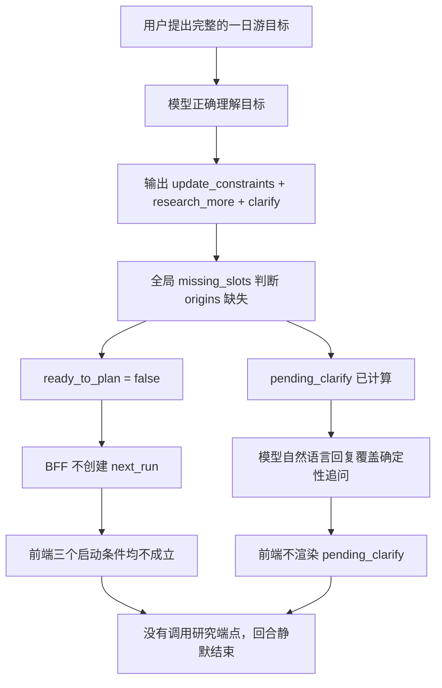
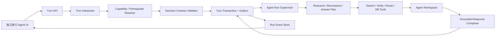
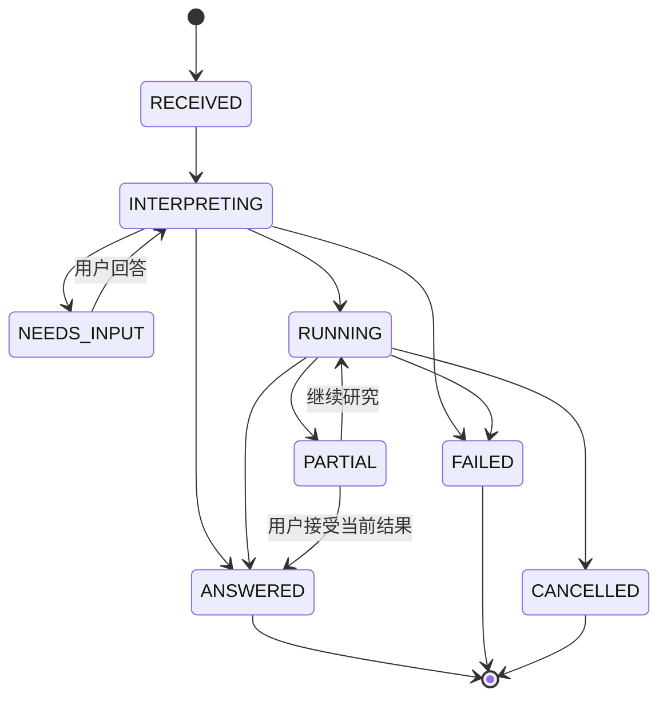

# AI 原生旅行 Agent 回合状态机与任务生命周期重构详细设计 v4

> 项目：WhereToGo2
> 日期：2026-07-31
> 状态：待实施
> 适用范围：DD-15 Copilot、BFF、DeepResearch 调度、Web 对话入口
> 前置设计：
> - `AI原生Agent与DeepResearch开放语义重构_v2.md`
> - `DeepResearch候选生命周期与旅行Agent上下文重构方案_v3.md`

## 1. 执行摘要

当前系统已经能够使用模型理解开放文本需求，也能够执行 DeepResearch、保留候选证据并
基于多轮上下文生成行程。但是，用户消息到实际任务执行之间仍由多套相互独立的协议控制：

1. 模型产生自然语言回复；
2. Turn Interpreter 产生 `acts`、`commands` 和 `pending_clarify`；
3. BFF 再派生 `auto_stream`、`restart_stream` 和 `ready_to_plan`；
4. Web 前端根据三个布尔字段猜测是否调用 `/stream` 或 `/research-more`；
5. 页面刷新后只恢复对话文本和最终 Bundle，不恢复待澄清问题或运行中任务。

这使系统可能出现最严重的一类 Agent 故障：**自然语言承诺会执行，但系统没有创建任务；
系统知道需要提问，但用户看不到问题；前端把没有结果的回合当成正常结束。**

2026-07-31 的真实故障即属于这一类：

```text
用户：我要去上海博物馆、世博馆、外滩和新天地，帮我设计一条一天的路线
助手：我先为您查询这四个景点的开放时间……
（此后没有研究进度、没有澄清问题、没有最终方案）
```

本次重构的核心不是再增加一个“市内路线不需要出发地”的特例，而是建立以下系统不变量：

- 每个用户回合必须进入一个用户可感知、可恢复的明确状态；
- 回复承诺执行研究时，真实任务必须已经创建；
- 系统需要用户输入时，问题必须明确显示并持久化；
- 缺少可选信息不能阻断当前仍然可以完成的工作；
- 前置条件由当前目标、工具能力和执行计划动态决定，而不是全局必填字段；
- 后台任务由服务端持有生命周期，浏览器只负责订阅和展示；
- 页面刷新、断线重连或服务重启后，用户仍能看到任务真实状态；
- 模型负责理解开放世界，确定性运行时负责验证动作契约和安全执行。

本设计把一次对话回合定义为一个持久化的 **Turn Transaction**，把检索、核实、编排和
回复合成定义为持久化的 **Agent Run**。它们共同构成可观察、可恢复、不会静默终止的
旅行 Agent 执行闭环。

## 2. 故障基线与证据

### 2.1 真实故障数据

故障对应数据库 Plan `4491`。系统已正确抽取：

- `target_city_name = 上海`
- 4 个独立的 `research_subgoals`
- 一日游路线的整体 `research_goal`
- 顺路、一天内完成等计划级验收条件

持久化的模型动作是：

```json
{
  "acts": [
    "update_constraints",
    "research_more",
    "clarify"
  ],
  "pending_clarify": [
    {
      "slot": "origins",
      "q": "你们从哪里出发？"
    }
  ]
}
```

但最终状态是：

- `ready_to_plan = false`
- 未设置 `restart_stream`
- 未设置 `auto_stream`
- 未产生可执行 `next_run`
- TripBundle 数量为 0
- `explore_bundle = null`
- 访问日志只有 `POST /plans/new/chat`
- 没有后续 `GET /plans/4491/stream`
- 没有后续 `POST /plans/4491/research-more`

因此这不是搜索超时或搜索 Provider 失败，而是研究从未开始。

### 2.2 当前故障链路



### 2.3 五个直接原因

1. `origins` 被建模为所有旅行任务的全局必填字段；
2. BFF 使用 `missing_slots()` 同时控制澄清和任务调度；
3. 模型自然语言回复与结构化动作之间没有一致性验证；
4. 前端只识别历史布尔字段，不执行统一命令协议；
5. 会话恢复接口丢弃待澄清和运行状态。

### 2.4 设计级根因

系统把三个不同概念混在了一起：

- **用户事实是否完整**：例如是否知道出发地；
- **当前任务是否可执行**：例如仅规划上海市内四个地点时是否能先继续；
- **最终方案是否已达到最佳质量**：例如知道酒店后能否进一步优化第一段交通。

事实不完整不等于任务不可执行，任务可执行也不等于所有信息都已获得。当前系统使用一个
`missing_slots()` 同时回答三个问题，导致过度阻塞。

## 3. 设计目标与非目标

### 3.1 设计目标

1. 用户可以从对话入口提出任意开放旅行目标、追问、修改和长程任务；
2. Agent 能在“直接回答、继续执行、部分执行并提问、阻塞提问”之间做动态决策；
3. 任意回合都不会进入没有任务、没有问题、没有答案的静默状态；
4. DeepResearch 及其他工具调用具有真实、持久化、可查询的运行实例；
5. 自然语言回复必须由真实执行状态约束；
6. 页面刷新或断线后可以恢复完整工作区；
7. 兼容 v3 的候选生命周期、Plan Ledger 和研究证据上下文；
8. 不通过扩充景点类别、需求关键词或用户句式枚举来实现泛化。

### 3.2 非目标

本设计不负责：

- 替换 Tavily、Bocha 等具体搜索 Provider；
- 重新设计候选语义评审算法；
- 自动替用户完成购票、支付或不可逆预订；
- 解决所有旅行领域数据准确性问题；
- 使用一个超长同步 HTTP 请求完成全部研究。

这些能力继续由现有工具层、v3 候选生命周期和证据策略负责。

## 4. 设计原则

### 4.1 模型理解开放世界，运行时约束有限动作

模型可以理解源码从未出现过的目标，例如：

- 在上海安排一条适合建筑摄影的阴天路线；
- 找三家适合长辈、能安静聊天且不需要排长队的餐厅；
- 保留博物馆但把下午替换为工业遗址；
- 先给粗略方案，酒店确定后再优化第一站。

运行时不枚举这些语义类别，只约束可执行动作：

```text
ANSWER
ASK
START_RUN
RECOMPOSE
UPDATE_MEMORY
SUBMIT_BOOKING_DRAFT
```

### 4.2 尽可能执行，必要时提问

澄清分为两类：

- **阻塞澄清**：缺少该信息后无法安全或有意义地执行当前动作；
- **非阻塞澄清**：当前可以先执行，答案只用于提升结果质量。

例如：

| 当前目标 | 缺少信息 | 决策 |
|---|---|---|
| 上海市内四个已指定地点排一天路线 | 住宿地/出发地 | 先规划，非阻塞提示可进一步优化 |
| 比较杭州到上海的高铁和航班 | 出发城市 | 阻塞提问 |
| 推荐上海本周展览 | 精确到达时间 | 使用周末默认范围，继续研究 |
| 预订指定日期酒店 | 日期 | 阻塞提问，不得猜测并执行预订 |

表中的场景是行为示例，不是源码中的特例表。真正判断来自目标计划和工具输入契约。

### 4.3 先创建任务，再承诺执行

助手只有在任务已经持久化为 `AgentRun` 后，才能回复：

> 我正在查询……

如果任务创建失败，必须诚实回复失败或降级方案，不能输出未来时承诺。

### 4.4 每轮必须有明确终态

一个 Turn 只能进入：

```text
ANSWERED
NEEDS_INPUT
RUNNING
PARTIAL
FAILED
CANCELLED
```

不允许存在“HTTP 200，但所有终态字段都为空”的结果。

### 4.5 服务端拥有执行权

浏览器不是工作流引擎。BFF 应原子地保存 Turn 并创建 Run，Worker/Planner 执行 Run；
前端通过 SSE 或轮询订阅状态。浏览器关闭不应导致任务消失。

## 5. 目标架构



v3 的候选层位于 `Agent Workspace` 内：

```text
raw candidates
→ semantic judgments
→ selection
→ plan delta
→ itinerary
```

v4 不替代这条链路，而是在其外部增加可靠的 Turn 和 Run 生命周期。

## 6. 核心领域模型

### 6.1 TurnStatus

```python
class TurnStatus(str, Enum):
    RECEIVED = "received"
    INTERPRETING = "interpreting"
    NEEDS_INPUT = "needs_input"
    RUNNING = "running"
    ANSWERED = "answered"
    PARTIAL = "partial"
    FAILED = "failed"
    CANCELLED = "cancelled"
```

允许的状态转移：



### 6.2 AgentTurn

建议新增持久化表 `agent_turns`：

```python
class AgentTurn:
    id: UUID
    plan_id: int
    sequence_no: int
    user_message: str
    status: TurnStatus
    interpretation: JSON
    visible_reply: str | None
    clarification_id: UUID | None
    run_id: UUID | None
    error_code: str | None
    created_at: datetime
    updated_at: datetime
    completed_at: datetime | None
```

约束：

- `(plan_id, sequence_no)` 唯一；
- 一个 Turn 最多绑定一个当前主 Run；
- 后续 Run 可以通过 `parent_run_id` 表示反思或补充研究；
- `status=RUNNING` 时 `run_id` 必须非空；
- `status=NEEDS_INPUT` 时 `clarification_id` 必须非空；
- `status=ANSWERED` 时 `visible_reply` 必须非空。

### 6.3 ClarificationRequest

```python
class ClarificationRequest:
    id: UUID
    turn_id: UUID
    question: str
    reason: str
    blocking: bool
    requested_facts: list[RequestedFact]
    assumptions_if_skipped: list[str]
    status: "open | answered | skipped | expired"
    answer_turn_id: UUID | None
```

`RequestedFact` 不是旅行语义枚举，而是可组合的事实请求：

```json
{
  "name": "origin",
  "description": "跨城交通的出发城市或区域",
  "required_by": ["transport_search"],
  "acceptable_default": null
}
```

如果是非阻塞澄清：

```json
{
  "name": "start_location",
  "description": "市内一日游第一段交通的起点",
  "required_by": ["first_leg_optimization"],
  "acceptable_default": "从第一个景点开始计算"
}
```

### 6.4 AgentRun

建议新增 `agent_runs`：

```python
class RunStatus(str, Enum):
    QUEUED = "queued"
    RUNNING = "running"
    WAITING_TOOL = "waiting_tool"
    COMPOSING = "composing"
    SUCCEEDED = "succeeded"
    PARTIAL = "partial"
    FAILED = "failed"
    CANCELLED = "cancelled"


class AgentRun:
    id: UUID
    plan_id: int
    turn_id: UUID
    parent_run_id: UUID | None
    run_type: "research | recompose | answer | replan"
    status: RunStatus
    goal: str
    execution_plan: JSON
    required_inputs: JSON
    assumptions: JSON
    checkpoint_ref: str | None
    result_bundle_id: int | None
    error_code: str | None
    retry_count: int
    created_at: datetime
    started_at: datetime | None
    heartbeat_at: datetime | None
    completed_at: datetime | None
```

### 6.5 RunEvent

建议新增 `agent_run_events`，作为 UI 展示和问题追踪的统一事实源：

```json
{
  "event_id": "evt_xxx",
  "run_id": "run_xxx",
  "sequence": 12,
  "type": "research.progress",
  "phase": "source_search",
  "message": "已完成 2/4 个研究任务",
  "progress": {
    "completed": 2,
    "total": 4
  },
  "created_at": "2026-07-31T10:30:00+08:00"
}
```

事件必须单调递增、可重复读取，SSE 断线后可以使用 `Last-Event-ID` 续传。

## 7. 动态前置条件解析

### 7.1 删除全局“是否能规划”判断

`missing_slots()` 可以保留为旧接口兼容，但不能继续决定整个 Agent 是否工作。

新链路使用：

```python
resolve_prerequisites(
    goals,
    proposed_actions,
    tool_specs,
    known_facts,
) -> PrerequisiteResolution
```

返回：

```json
{
  "executable_actions": [
    {
      "type": "research",
      "goal": "核实四个地点并生成市内路线",
      "assumptions": [
        "从第一个景点开始计算市内路线"
      ]
    }
  ],
  "blocking_missing": [],
  "non_blocking_missing": [
    {
      "fact": "start_location",
      "reason": "可进一步优化第一段交通"
    }
  ]
}
```

### 7.2 工具声明输入契约

每个工具或工作流节点声明自己的输入需求：

```python
class ToolInputSpec:
    name: str
    requirement: "hard | soft | defaultable"
    default_strategy: str | None
    description: str
```

示例：

```json
{
  "tool": "intercity_transport_search",
  "inputs": [
    {"name": "origin", "requirement": "hard"},
    {"name": "destination", "requirement": "hard"},
    {"name": "travel_date", "requirement": "defaultable",
     "default_strategy": "current_planning_window"}
  ]
}
```

```json
{
  "tool": "in_city_route_optimizer",
  "inputs": [
    {"name": "candidate_locations", "requirement": "hard"},
    {"name": "start_location", "requirement": "soft"},
    {"name": "time_window", "requirement": "defaultable",
     "default_strategy": "full_day"}
  ]
}
```

这里枚举的是工具参数，不是用户意图或语言空间。新增任何开放体验需求都不需要修改该协议；
只有新增工具能力时才声明其输入契约。

### 7.3 部分执行

当某些动作缺少硬输入、但其他动作可执行时：

```text
可执行部分 → 立即创建 Run
阻塞部分 → 创建 ClarificationRequest
TurnStatus → RUNNING
回复 → 说明正在做什么，以及补充信息会影响哪一部分
```

例如可以先研究上海四个地点的开放时间，再等用户补充抵达车站后优化首段交通。

## 8. Turn Decision 协议

### 8.1 Interpreter 输出

Interpreter 只负责语义理解，不直接承诺任务已启动：

```json
{
  "goals": [
    {
      "id": "goal_1",
      "objective": "把四个指定地点安排成一天内顺路的路线",
      "required": true
    }
  ],
  "proposed_actions": [
    {
      "type": "research",
      "reason": "需要核实开放时间、位置和建议时长"
    },
    {
      "type": "compose_itinerary",
      "reason": "用户要求生成路线"
    }
  ],
  "constraint_operations": [],
  "clarification_candidates": [
    {
      "fact": "start_location",
      "reason": "用于优化第一段交通"
    }
  ],
  "draft_reply": null
}
```

`draft_reply` 只能用于直接回答或建议措辞。是否可以说“正在研究”由后续 Run 创建结果决定。

### 8.2 Runtime Decision

由确定性运行时把 Interpreter 结果转换为：

```json
{
  "turn_status": "running",
  "visible_reply": "我先按抵达上海市区后开始游览来规划……",
  "run": {
    "id": "run_xxx",
    "status": "queued",
    "type": "research"
  },
  "clarification": {
    "blocking": false,
    "question": "如果你告诉我酒店或抵达车站，我还能优化第一段交通。"
  }
}
```

### 8.3 强制不变量

提交响应前运行 `validate_turn_contract()`：

```python
def validate_turn_contract(result: TurnResult) -> None:
    if result.status == RUNNING:
        assert result.run_id
    if result.status == NEEDS_INPUT:
        assert result.clarification
        assert result.clarification.blocking
        assert result.clarification.question
    if result.status == ANSWERED:
        assert result.visible_reply
    if claims_future_work(result.visible_reply):
        assert result.run_id
    if result.run_id:
        assert result.run_persisted
    assert not (
        result.status in TERMINAL_STATUSES
        and not result.visible_reply
        and not result.error
    )
```

`claims_future_work()` 不应通过中文关键词表实现。建议由回复模板控制：

- 运行中回复由运行时根据 `run_id` 生成；
- 模型只能提供语气和任务摘要；
- 只有 `RUNNING` 模板允许使用“正在、接下来会、我来查询”等承诺。

这样从源头消除“语言说会做、系统实际没做”的可能。

## 9. 服务端执行生命周期

### 9.1 Chat API

建议替换当前由前端触发下一步的协议：

```http
POST /agent/conversations/{plan_id}/turns
Idempotency-Key: <client generated uuid>
```

请求：

```json
{
  "message": "我要去上海博物馆、世博馆、外滩和新天地，帮我设计一天路线"
}
```

运行中响应可使用 HTTP 202：

```json
{
  "turn_id": "turn_xxx",
  "turn_status": "running",
  "assistant_message": {
    "content": "我先核实四个地点的信息，并按市内顺路程度编排。"
  },
  "run": {
    "id": "run_xxx",
    "status": "queued",
    "events_url": "/agent/runs/run_xxx/events"
  },
  "clarification": {
    "blocking": false,
    "question": "如果你告诉我酒店或抵达车站，我还能优化第一段交通。"
  }
}
```

阻塞澄清响应：

```json
{
  "turn_id": "turn_xxx",
  "turn_status": "needs_input",
  "assistant_message": {
    "content": "要比较跨城交通，我还需要知道你从哪个城市出发。"
  },
  "clarification": {
    "id": "clarify_xxx",
    "blocking": true,
    "question": "你从哪个城市出发？"
  },
  "run": null
}
```

### 9.2 原子提交与 Outbox

在一个数据库事务中完成：

1. 写入用户消息；
2. 写入 AgentTurn；
3. 更新 Plan 约束和 Goal Ledger；
4. 写入 ClarificationRequest；
5. 如可执行，写入 AgentRun；
6. 写入 Outbox 事件 `agent_run.requested`；
7. 提交事务。

Worker 从 Outbox 获取任务。这样可以避免：

- 回复已经说“开始研究”，但 Run 创建失败；
- Run 已创建，但用户消息没有持久化；
- HTTP 连接断开导致任务没有启动；
- 重试 POST 创建两个重复研究任务。

### 9.3 幂等性

`Idempotency-Key` 与 `(plan_id, client_key)` 唯一。重复请求返回同一个 Turn 和 Run。

工具调用也使用稳定的：

```text
run_id + node_id + attempt
```

作为幂等键，防止 SSE 重连或 Worker 重试重复入库候选。

### 9.4 Run Supervisor

Run Supervisor 负责：

- 加载完整对话、Plan Ledger、当前行程和研究证据；
- 执行 capability plan；
- 发布进度事件；
- 维护 heartbeat；
- 保存 checkpoint；
- 聚合部分成功；
- 调用最终回复模型；
- 原子提交 TripBundle、Turn 终态和最终助手消息。

浏览器不再调用 `/stream` 来“启动”工作，只订阅已经存在的 Run。

## 10. 澄清与对话体验

### 10.1 阻塞澄清

满足以下条件时才阻塞：

- 当前核心目标没有任何可安全执行部分；
- 缺失信息无法可靠默认；
- 猜测会产生明显错误或不可逆副作用；
- 工具声明该输入为 hard requirement。

界面必须展示：

- 清晰问题；
- 为什么需要；
- 可以如何回答；
- 是否允许跳过；
- 跳过时采用什么假设。

### 10.2 非阻塞澄清

非阻塞问题不能阻止 Run：

```text
助手：我先按从人民广场附近开始规划。你若告诉我酒店位置，我可以继续优化第一段交通。
状态：正在核实四个地点的开放时间……
```

用户在 Run 执行过程中回答时：

- 如果只影响后续节点，更新当前 Run 输入；
- 如果影响已经完成的关键节点，创建 child run；
- 不直接取消已经获得的有效研究证据；
- 通过 Plan Delta 明确说明哪些安排被重新计算。

### 10.3 用户不回答

非阻塞澄清可以保持 open，但不影响 Turn 完成。最终回复要披露使用的假设。

阻塞澄清未回答时 Turn 保持 `NEEDS_INPUT`，页面刷新后继续显示，不得退化成普通历史文本。

## 11. 前端重构

### 11.1 前端职责

前端只负责：

1. 发送用户消息；
2. 渲染 Turn 状态；
3. 订阅 Run Event；
4. 展示澄清问题；
5. 展示最终回复、候选和行程；
6. 断线后恢复。

前端不再决定是否需要研究，也不再根据多个布尔字段拼装工作流。

### 11.2 UI 状态

```text
idle
submitting
needs_input
running
partial
completed
failed
```

运行中展示：

- 当前任务摘要；
- 当前 phase；
- 已完成/总任务数量；
- 最近一次 heartbeat；
- 取消按钮；
- 可继续对话的输入框。

输入框不应在整个 DeepResearch 期间完全锁死。新消息通过 Turn Supervisor 判断：

- 合并到当前 Run；
- 创建补充 Run；
- 取消并替换；
- 作为普通问题直接回答。

### 11.3 恢复协议

建议：

```http
GET /agent/conversations/{plan_id}/workspace
```

返回：

```json
{
  "conversation": [],
  "active_turn": {},
  "active_run": {},
  "open_clarifications": [],
  "current_plan": {},
  "research_workspace": {},
  "last_event_id": "evt_xxx"
}
```

页面加载后：

- 有 `active_run`：从 `last_event_id` 继续订阅；
- 有阻塞 `open_clarifications`：恢复问题卡片；
- Run 已结束但 Bundle 未渲染：拉取最终 Turn；
- heartbeat 超时：显示“正在恢复任务”，由服务端判断重试或失败；
- 绝不只恢复一句“我先查询”。

### 11.4 兼容阶段

迁移期间 BFF 可以继续返回：

```json
{
  "auto_stream": false,
  "restart_stream": false,
  "ready_to_plan": true
}
```

但新前端只使用 `turn_status` 和 `run`。旧字段由适配器从新状态派生，禁止反向参与决策。

## 12. 完整上下文与最终回复

Run 执行和最终 Composer 使用同一个有界 Context Pack：

```json
{
  "conversation_memory": {
    "recent_turns": [],
    "earlier_turn_ledger": []
  },
  "goals": [],
  "constraints": {},
  "assumptions": [],
  "open_clarifications": [],
  "plan_ledger": {},
  "plan_delta": {},
  "current_itinerary": [],
  "research_raw_candidates": [],
  "research_judged_candidates": [],
  "research_selection": {},
  "evidence_gaps": [],
  "run_trace_summary": {}
}
```

最终回复必须：

- 回答用户最新一轮真实问题；
- 保留用户明确要求保留的安排；
- 引用当前 Run 的真实成果；
- 区分已核实、来源支持但待复核、无法核实；
- 披露默认假设；
- 不把进度日志当最终回复；
- 与持久化 itinerary 完全一致。

## 13. 错误、超时与恢复

### 13.1 失败分类

```text
INTERPRETATION_FAILED
PREREQUISITE_BLOCKED
RUN_CREATION_FAILED
TOOL_TIMEOUT
TOOL_AUTH_FAILED
PROVIDER_RATE_LIMITED
PARTIAL_EVIDENCE
COMPOSITION_FAILED
PERSISTENCE_FAILED
RUN_STALLED
```

每种错误必须映射到用户可理解的信息和可执行恢复动作。

### 13.2 超时语义

600 秒是单个长调用或锁的上限，不应成为整个 Agent 的“等待黑盒”。

Run 应持续产生 heartbeat：

```text
queued
planning
searching
verifying
selecting
composing
succeeded
```

如果某个工具超过自身预算：

- 保存已获得结果；
- 标记该工具超时；
- 继续可执行节点；
- 最终 Turn 为 `PARTIAL` 或 `ANSWERED`；
- 向用户说明缺口；
- 不把超时解释为“没有相关地点”。

### 13.3 Stalled Run

服务端定期检查：

```python
if run.status in ACTIVE and now - heartbeat_at > stall_threshold:
    mark_stalled()
    retry_from_checkpoint_or_fail()
```

前端只展示服务端结论，不自行猜测任务是否死亡。

### 13.4 回复合成失败

如果研究成功但最终模型回复失败：

- 不丢弃研究成果；
- 使用结构化降级模板生成简短回复；
- Bundle 与候选仍可展示；
- Turn 标记 `PARTIAL`；
- 支持只重试 Composer，不重新搜索。

## 14. 可观测性

### 14.1 统一关联标识

每条日志至少包含：

```text
plan_id
turn_id
run_id
node_id
tool_call_id
provider
attempt
elapsed_ms
status
```

### 14.2 关键业务指标

- `turn_silent_terminal_total`：没有答案、问题或 Run 的终态数量，目标必须为 0；
- `promised_without_run_total`：回复承诺未来工作但没有 Run，目标必须为 0；
- `hidden_clarification_total`：存在阻塞澄清但 UI 不可见，目标必须为 0；
- `run_start_latency_ms`：Turn 接收到 Run 创建完成的时间；
- `run_first_event_latency_ms`：Run 创建到首个可见进度的时间；
- `run_recovery_success_rate`；
- `clarification_blocking_rate`；
- `non_blocking_progress_rate`；
- `research_partial_success_rate`；
- `turn_end_to_end_latency_ms`。

### 14.3 Trace 视图

开发环境为每个 Turn 提供只读 Trace：

```text
原始用户消息
→ Interpreter JSON
→ 前置条件解析
→ Contract Validation
→ 创建的 Run
→ 工具调用及结果
→ 候选生命周期
→ Composer 输入摘要
→ 最终状态和 Bundle
```

敏感 Key、完整隐私信息和模型隐藏推理不得写入 Trace。

## 15. 数据迁移与兼容

### 15.1 第一阶段：影子写入

- 新建 `agent_turns`、`agent_runs`、`agent_run_events`、`clarification_requests`；
- 现有 `plans.conversation` 继续写入；
- 同时影子生成 Turn/Run 状态但旧前端不消费；
- 对比旧布尔逻辑和新 Runtime Decision。

### 15.2 第二阶段：服务端调度

- Chat API 在事务内创建 Run；
- 旧 `/stream` 和 `/research-more` 变为内部执行入口或兼容代理；
- 新前端订阅 Run；
- 旧前端字段由新状态派生。

### 15.3 第三阶段：新 Workspace 恢复

- `/agent-state` 替换为完整 Workspace API；
- 恢复 active Run 和 clarification；
- 支持 SSE 续传；
- 对话输入支持运行中继续修改。

### 15.4 第四阶段：移除旧控制字段

删除：

- `auto_stream`
- `restart_stream`
- `ready_to_plan`
- 前端通过三个条件启动工作流的代码
- 全局 `missing_slots()` 对 Agent 执行权的控制

`missing_slots()` 仅可在旧接口或特定工具适配层保留。

## 16. 代码改造映射

### 16.1 `src/wheretogo/copilot/interpreter.py`

- 输出开放目标和 proposed actions；
- 不生成已经开始执行的语言承诺；
- clarification 作为候选输入需求，不直接决定阻塞；
- 保留完整多轮上下文和开放 `research_subgoals`。

### 16.2 `src/wheretogo/copilot/handle_turn.py`

- 拆分为：
  - `interpret_turn`
  - `resolve_prerequisites`
  - `build_runtime_decision`
  - `validate_turn_contract`
- 删除“有 model_reply 就不附加澄清问题”的逻辑；
- 不再由 legacy intent 决定是否调用工具；
- 模型回复只能在 Runtime Decision 确定后生成或套用模板。

### 16.3 `src/wheretogo/domain/constraints.py`

- 将 `missing_slots()` 降级为兼容工具；
- 新增 task-scoped prerequisite resolver；
- 工具输入区分 hard、soft、defaultable；
- 默认假设写入 Turn/Run，而不是静默应用。

### 16.4 `src/wheretogo/bff/app.py`

- Chat handler 原子写入 Turn、Clarification、Run 和 Outbox；
- 不再要求前端调用第二个端点才能真正启动；
- 返回统一 `turn_status`；
- 提供 Run、Event 和 Workspace API；
- agent-state 恢复完整待办状态；
- 使用幂等键避免重复 Run。

### 16.5 `src/wheretogo/orchestration/*`

- Planner 接收 `run_id`；
- 所有节点发布结构化 RunEvent；
- checkpoint 与 Run 绑定；
- 支持仅重试失败节点或 Composer；
- Run 完成时原子更新 TripBundle、Plan Ledger 和 Turn。

### 16.6 `web/index.html`

- 删除三个布尔字段的调度分支；
- 使用 Turn 状态渲染；
- 订阅已有 Run，不负责创建执行链；
- 显示阻塞/非阻塞澄清；
- 页面刷新后恢复 active Run；
- 支持 `Last-Event-ID`；
- 运行中允许用户继续发送修改。

## 17. 测试策略

### 17.1 状态机属性测试

对任意合法 Turn Decision 验证：

```text
RUNNING     → 必须存在持久化 run_id
NEEDS_INPUT → 必须存在可见的 blocking question
ANSWERED    → 必须存在非空回复
PARTIAL     → 必须存在已获得结果或明确缺口
FAILED      → 必须存在用户可见错误和恢复建议
```

任何状态都不能同时缺少：

```text
answer + question + run + error
```

### 17.2 合约测试

- Interpreter 输出 `research_more + clarify` 时，Runtime 能区分阻塞与非阻塞；
- 回复包含执行承诺时必须有 Run；
- Run 创建失败时不返回“正在查询”；
- pending clarification 必须出现在 Chat API 和 Workspace API；
- 刷新页面后仍显示澄清问题；
- `next_run` 不再由前端布尔组合推导。

### 17.3 端到端回归

#### 场景 A：本次真实故障

```text
用户：我要去上海博物馆、世博馆、外滩和新天地，帮我设计一天路线
```

验收：

- 不要求用户先提供跨城出发地；
- 2 秒内返回 `turn_status=running` 和真实 `run_id`；
- UI 显示研究已开始；
- 可以非阻塞提示酒店/车站信息；
- 最终生成包含四个地点的路线；
- 页面刷新不丢任务。

#### 场景 B：真正需要出发地

```text
用户：帮我比较去上海坐高铁还是飞机
```

验收：

- 明确询问从哪里出发；
- `turn_status=needs_input`；
- 问题在界面可见；
- 不启动无意义交通查询；
- 用户回答后从原 Turn 上下文继续。

#### 场景 C：研究中修改

```text
用户：路线里再加入一家本帮菜餐馆，前面四个地点保留
```

验收：

- 不清空已完成研究；
- 更新 Goal Ledger；
- 创建补充或替换 Run；
- 进度和最终 Plan Delta 可见；
- 回复与行程卡片一致。

#### 场景 D：明确禁止搜索

```text
用户：不要再搜索，只基于现有候选重排
```

验收：

- 不创建 Research Run；
- 创建 Recompose Run 或直接回答；
- 只使用当前 Workspace；
- 结果持久化；
- 刷新后保持一致。

#### 场景 E：Provider 超时

验收：

- Run 仍有 heartbeat；
- 已获得候选不丢失；
- Turn 结束为 `partial`；
- UI 明确展示缺口；
- 不声称“没有相关去处”。

### 17.4 故障注入

- Interpreter 超时；
- Run 创建事务失败；
- Outbox 消费重复；
- SSE 中途断开；
- Worker 进程重启；
- 搜索 Provider 401/429/timeout；
- Semantic Judge 部分批次失败；
- Composer 超时；
- Bundle 写入失败。

每类故障都必须验证用户可感知状态和恢复路径。

## 18. 验收标准

以下条件全部满足后，重构才可验收：

1. 本次 Plan `4491` 等价场景可以无出发地启动市内路线研究；
2. 不再出现只回复“我先查询”但没有 `run_id` 的情况；
3. 阻塞澄清 100% 在 UI 可见；
4. `turn_silent_terminal_total = 0`；
5. 页面刷新可以恢复运行中任务和待澄清问题；
6. 浏览器关闭后 Run 继续执行；
7. 前端不再通过 `auto_stream/restart_stream/ready_to_plan` 决定执行；
8. 所有现有 DeepResearch 候选生命周期回归测试通过；
9. 新增 Turn/Run 状态机、幂等、断线恢复和故障注入测试；
10. 至少完成以下真实多轮验收：
    - 首轮市内路线；
    - 跨城澄清；
    - 研究中追加需求；
    - 禁止搜索的本地重排；
    - 刷新恢复；
    - Provider 部分失败。

## 19. 实施优先级

### P0：消除静默失败

- 引入统一 `turn_status`；
- 增加 Contract Validator；
- 澄清问题强制可见；
- 将出发地从全局执行前置条件移除；
- Chat 请求内创建真实 Run；
- 前端根据 Run 订阅进度。

### P1：可恢复执行

- 持久化 AgentTurn、AgentRun、RunEvent；
- Workspace 恢复 active Run 和 clarification；
- SSE 续传和 heartbeat；
- 幂等请求和 Outbox。

### P2：运行中持续对话

- 支持用户在研究中追加、替换、取消目标；
- Run 合并和 child run；
- 更细粒度 Plan Delta；
- 开发 Trace 页面和业务指标。

## 20. 最终技术判断

WhereToGo2 要成为 AI 原生旅行 Agent，核心标准不是“用了大模型”或“能调用搜索”，而是：

> 模型理解的目标必须可靠地转化为真实、可观察、可恢复的行动；需要信息时必须自然提问；
> 能继续的部分不能被缺失的可选信息阻塞；每个自然语言承诺都必须有系统状态作为事实依据。

v2 解决开放语义，v3 解决 DeepResearch 候选和上下文生命周期，v4 必须解决最外层的
**Turn → Run → Observe → Answer** 执行闭环。只有三层同时成立，对话页面才能真正成为
一个独立、连续、可信的旅行 Agent 入口。
