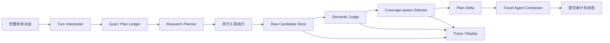

# Deep Research 候选生命周期与旅行 Agent 上下文重构方案 v3

> 项目：WhereToGo2
> 日期：2026-07-30
> 状态：核心重构已落地并完成自动化与真实 UI 验证
> 延续：`AI原生Agent与DeepResearch开放语义重构_v2.md`

## 1. 结论

当前问题已经不是意图关键词覆盖，而是 Deep Research 的候选生命周期和对话 Agent
之间存在断层：

1. 检索和抽取已经得到符合新增目标的候选；
2. 旧行程与新候选在语义评审前混入同一个有序列表；
3. 语义评审超时后，降级逻辑保持输入顺序；
4. 全局 Top-K 截断让旧行程占满名额；
5. 反思节点把“评审不可用”标记为“方案已改善”，并清空新候选；
6. 最终回复模型只看到旧行程，无法利用 Deep Research 的真实成果。

正确的修复不是增加“餐馆”规则，而是建立以下通用不变量：

- 用户目标、体验要求、修改意见和研究问题始终是开放文本；
- 旧行程、新增候选、已评审候选和最终选择必须分层保存；
- 选择先满足用户子目标覆盖，再做全局排序和数量截断；
- 模型或基础设施失败不能被解释为“没有结果”或“已经改善”；
- Deep Research 原始证据在最终回复完成前不得丢弃；
- 最终回复模型必须同时看到对话记忆、当前行程、新研究成果、证据状态和知识缺口。

## 2. 本次故障基线

复现会话：

1. 用户从杭州去上海；
2. 行程保留上海市历史博物馆、新天地、世博会博物馆和外滩；
3. 用户新增“吃当地特色美食，推荐几家餐馆”。

实际运行数据：

- 4 个研究任务；
- 20 个外部来源；
- 30 个开放候选；
- 来源中包含本帮菜、老字号、人和馆、弄堂小吃、米其林上海指南；
- `candidate_semantic_judge` 在 60 秒超时；
- 最终 10 个候选全部是上一轮旧景点；
- `semantic_match_count = 0`；
- `criterion_coverage = 0`；
- `covered_subgoal_ids = []`；
- 状态却被写成 `research_outcome = improved`。

这组数据应作为重构后的固定回归样例。

## 3. 设计边界

### 3.1 开放语义

以下内容不能做领域枚举、关键词表或 `if/else` 特例：

- 用户想体验什么；
- 用户不想要什么；
- 新增、替换、保留、比较或组合的自然语言要求；
- research goal；
- acceptance criteria；
- research subgoal 的 objective；
- 候选属于什么现实世界对象。

无论用户下一次提出餐馆、观星、工业遗址、安静书店、雨天散步路线还是源码中从未
出现过的需求，都应由模型生成新的研究目标、子目标和验收标准，不需要发布代码。

### 3.2 有限执行协议

以下内容应保持类型化，因为它们决定程序如何安全运行：

- 工具名称、参数和权限；
- 研究轮次、并发、预算和超时；
- 候选处理阶段；
- 证据确认状态；
- 停止原因；
- 对计划执行新增、替换、删除、保留的操作。

这是 AI 原生 Agent 的边界：模型理解开放世界，运行时约束有限动作。

## 4. 目标链路



一次用户输入应形成一个有编号的 turn transaction：

```text
理解用户本轮修改
→ 形成计划差量和研究缺口
→ 执行研究工具
→ 保存原始候选
→ 按每个子目标进行语义判断
→ 形成候选选择和未解决缺口
→ 最终模型基于完整上下文生成自然回复与行程差量
→ 原子提交状态
```

任何中间失败都必须保留前面已经获得的证据，并产生可恢复状态。

## 5. 候选生命周期重构

### 5.1 四层候选，不再共用一个 `activities`

建议把当前含义过载的 `activities` 拆为：

```python
research_baseline
research_raw_candidates
research_judged_candidates
plan_selected_candidates
```

- `research_baseline`：进入本轮前的有效行程，不代表符合本轮新增要求；
- `research_raw_candidates`：本轮搜索和抽取的完整结果；
- `research_judged_candidates`：逐子目标评审后的结果；
- `plan_selected_candidates`：最终用于计划和卡片的候选。

兼容期可继续向 `activities` 写入 `plan_selected_candidates`，但任何节点不得再从
`activities` 反推“本轮新研究是否成功”。

### 5.2 通用 Candidate Envelope

候选对象不绑定“活动”概念：

```json
{
  "candidate_id": "稳定标识",
  "title": "来源中的实体名称",
  "candidate_kind": "开放文本",
  "description": "来源支持的摘要",
  "research_task_id": "产生它的研究任务",
  "suggested_subgoal_ids": ["本轮子目标"],
  "origin": "baseline | current_research",
  "availability": {
    "mode": "dated | recurring | always | unknown",
    "recurring_hours": [],
    "date_specific_status": "confirmed | no_known_conflict | unknown | contradicted"
  },
  "claims": [],
  "evidence_refs": [],
  "semantic_assessments": []
}
```

`candidate_kind` 仍是开放文本；有限字段描述的是处理行为与证据状态，不是用户兴趣
类别。

### 5.3 新旧候选分轨评审

禁止继续使用：

```python
acts = [*baseline, *fresh]
evaluate(acts)
top_k(acts, 10)
```

改为：

```python
fresh_judged = evaluate(fresh, current_required_subgoals)
baseline_judged = evaluate(
    baseline,
    only_subgoals_that_baseline_is_expected_to_cover,
)
selection = select_by_coverage(
    baseline=baseline_judged,
    fresh=fresh_judged,
    revision_mode=revision_mode,
)
```

`extend` 的含义是保留未受影响的旧行程，再加入覆盖新增子目标的新候选；它不意味着
旧候选在本轮评审中拥有排序优先权。

### 5.4 覆盖优先选择

全局 Top-K 必须放在子目标覆盖之后：

1. 每个 required subgoal 至少保留若干最优候选；
2. 保留用户明确锁定且未被修改的旧行程；
3. 其余名额再进行全局质量、证据和多样性排序；
4. 若容量不足，允许 UI 分区展示，不得静默删除整个子目标。

选择结果必须包含：

```json
{
  "selected_candidate_ids": [],
  "preserved_candidate_ids": [],
  "covered_subgoal_ids": [],
  "missing_subgoal_ids": [],
  "rejected": [
    {"candidate_id": "...", "reason": "..."}
  ]
}
```

### 5.5 单候选相关性与集合完整性必须分开

一个候选只能证明“它是计划的一个有效组件”，不能独自证明整套行程完整。例如四个
指定地点形成一个复合目标时，每个地点只需支持自己对应的要求；系统再在候选集合层
判断四个地点是否全部齐备。

每个开放子目标可携带通用的 `target_count`：

```json
{
  "id": "稳定 id",
  "objective": "开放文本目标",
  "acceptance_criteria": ["候选本身的可核实标准"],
  "required": true,
  "target_count": 3
}
```

`target_count` 只表示该目标期望几个不同候选，不表达餐馆、景点等领域类别。候选评审
负责判断相关性；集合评审按去重实体数和子目标归属判断完整性。多批、多轮研究的覆盖
度必须在 baseline 与累计 judged candidates 上聚合，后续空批次不能把前一批已经完成
的目标清零。

## 6. 语义评审可靠性与降级策略

### 6.1 立即止血

`candidate_semantic_judge` 超时从硬编码 60 秒调整为独立配置：

```text
WTG_DEEP_RESEARCH_SEMANTIC_JUDGE_TIMEOUT_S=600
```

默认值为 600 秒。它不改变对话理解、回复生成等短调用的超时。

600 秒只是减少当前推理模型被过早中断，不是最终交互方案。等待十分钟仍不可作为
产品常态。

同时独立设置候选抽取超时 180 秒、最终行程编排超时 600 秒和同一计划锁租期
600 秒，避免通用 60 秒默认值截断长研究调用。超时彼此独立，不能用一个全局常量
掩盖不同阶段的延迟特征。

### 6.2 最终方案

将最多 40 个候选的一次大评审改为按子目标和 token 预算分批：

- 每批 8～12 个候选；
- 批次并行数受配置控制；
- 每批独立记录成功、超时、无效 JSON；
- 成功批次立即落 checkpoint；
- 失败批次可重试一次或切换备用模型；
- 总体受 600 秒 turn deadline 熔断；
- 允许返回 partial，而不是全有或全无。

### 6.3 评审失败时的正确降级

语义模型不可用时：

1. 不得把所有候选判为不匹配；
2. 不得把旧行程判为新增目标的匹配结果；
3. 保留本轮有来源的候选，状态标为 `unknown/pending_review`；
4. 根据 `research_task_id` 和 `suggested_subgoal_ids` 保持候选与研究目标的来源关系；
5. 最终模型可以介绍这些候选，但必须明确哪些事实已证实、哪些仍待确认；
6. `research_outcome` 应为 `partial_unverified`，不能写 `improved`；
7. 原始候选至少保留到最终回复完成，并持久化到研究快照。

这里使用的是研究任务的结构化 provenance，不是按标题关键词猜测类别。

## 7. 证据和营业时间模型

当前“目标日期没有明确营业证明就拒绝餐馆”的标准不适合常设场所。应把事实拆成
独立 claim：

- 实体存在；
- 名称和地址；
- 特色菜或体验特征；
- 日常/每周营业时间；
- 目标日期的临时调整；
- 是否需要预约。

对目标日期的判断按以下方式组合：

```text
官方明确目标日营业              → confirmed
有周期营业时间且无闭店冲突        → no_known_conflict
只有实体和地址，缺少营业信息       → unknown
官方明确目标日闭店或休馆           → contradicted
```

`unknown` 可以进入探索方案，但必须提示确认；只有 `contradicted` 才应因为日期被排除。
这套逻辑适用于餐馆、景点、商店、展馆等任何常设实体，不需要领域特例。

## 8. 状态机重构

### 8.1 研究执行状态

建议使用以下执行状态：

```text
planning
searching
extracting
judging
selecting
composing
completed
partial
failed
```

### 8.2 研究结果状态

结果状态必须独立于执行状态：

```text
improved
unchanged
partial_unverified
no_supported_match
provider_unavailable
budget_exhausted
```

`improved` 必须满足至少一个可验证条件：

- 新增 required subgoal 被覆盖；
- 现有 subgoal 的候选证据质量提升；
- 用户要求的替换真正改变了选择。

不能再用 `bool(combined)` 判断改善，因为 `combined` 可能全部是 baseline。

### 8.3 状态转移守卫

必须增加以下确定性守卫：

- `semantic_evaluated == false` 时不能进入 verified success；
- `new_subgoal_coverage == 0` 时不能宣称本轮改善；
- `raw_candidate_count > 0` 且 `selected_fresh_count == 0` 时记录
  `candidate_loss_anomaly`；
- 清空 raw candidates 前必须确认 compose 已完成并生成研究快照；
- 最终回复中的“没有找到”只能由 `no_supported_match` 支持；
- provider 或 judge 不可用时只能表述为“暂未完成确认”。

## 9. 旅行 Agent 上下文重构

### 9.1 最终模型需要的 Context Pack

最终回复不能只接收筛选后的活动卡片。应接收：

```json
{
  "conversation_memory": {
    "recent_turns": [],
    "durable_summary": "",
    "user_commitments": []
  },
  "plan_ledger": {
    "locked_items": [],
    "current_itinerary": [],
    "pending_changes": []
  },
  "current_turn": {
    "user_message": "",
    "plan_operations": [],
    "research_goal": "",
    "subgoals": []
  },
  "research_context": {
    "raw_candidate_summaries": [],
    "judged_candidates": [],
    "selection": {},
    "evidence_claims": [],
    "knowledge_gaps": [],
    "provider_failures": []
  }
}
```

模型基于这个 Context Pack 生成：

- 对用户的自然回复；
- 行程差量；
- 新的完整行程草案；
- 尚未解决的问题；
- 下一步可执行动作。

### 9.2 历史对话策略

短期内保留：

- 最近 24 轮原文；
- 更早对话的结构化 ledger；
- 用户明确锁定、否定和修改过的决定；
- 上一份有效行程；
- 最近若干轮研究摘要和未解决缺口。

不能只总结用户偏好而丢掉承诺，例如“这四个地方就这样安排”。计划承诺应进入
`plan_ledger.locked_items`，与一般聊天摘要分开。

### 9.3 回复与计划原子提交

当前生成过程可能先改活动列表，再生成回复。目标实现应先形成 `PlanDelta`，校验后一次
提交：

```json
{
  "preserve": [],
  "add": [],
  "remove": [],
  "replace": [],
  "schedule": [],
  "unresolved": []
}
```

若最终生成失败，保留上一份完整有效计划和本轮研究快照；不能留下“状态已改但回复没
生成”的半成品。

最终输出还必须执行目标级完整性校验：

1. `candidate_title` 必须来自当前有证据候选；
2. 每个 required subgoal 在行程中的不同候选数必须达到 `target_count`；
3. 模型引用无证据对象或数量不足时，从已评审候选中补齐；
4. 若发生修复，回复同步依据修复后的行程重写，禁止出现“文字说三家、行程只有两家”。

## 10. 进度与可观测性

UI 的数字必须来自同一轮的明确指标：

- `sources_found`
- `raw_candidates_extracted`
- `candidates_judged`
- `fresh_candidates_selected`
- `baseline_candidates_preserved`
- `covered_subgoals / required_subgoals`
- `pending_review_count`

禁止再把最终列表长度显示为“新的匹配候选”。

每轮 trace 至少记录：

- turn id、research cycle id；
- research brief 和任务；
- 每个来源的工具结果；
- 每个候选来自哪个任务和来源；
- availability 过滤前后数量；
- 每批语义评审耗时和结果；
- 每个候选被选中或拒绝的原因；
- baseline/fresh 数量；
- compose 输入摘要和输出校验结果。

研究快照应支持按 `plan_id + turn_id` 回放，不依赖易失日志。

## 11. 分阶段实施

### P0：立即止血

- [x] 语义评审超时独立配置，默认 600 秒；
- [x] 增加测试，确认评审调用读取 600 秒配置；
- [x] 服务重启后检查运行配置；
- [x] 增加超时、耗时、输入候选数日志。

### P1：修复候选丢失

涉及：

- `research/semantics.py`
- `orchestration/nodes.py`
- `orchestration/state.py`
- `research/schemas.py`

实施：

1. 增加 raw/judged/selected 三层候选状态；
2. baseline 和 fresh 分轨；
3. 删除评审前的 `[*baseline, *acts]`；
4. 实现 coverage-aware selector；
5. judge 不可用时保留 fresh pending candidates；
6. 禁止错误写入 `improved`；
7. compose 前禁止清空研究快照。

状态：已完成。

### P2：证据和可用性重构

1. 候选使用 claim/evidence refs；
2. 区分 recurring hours 与 date-specific override；
3. unknown 可展示但明确待确认；
4. contradiction 才执行硬排除；
5. 为来源冲突增加证据合并策略。

状态：本轮完成 1～4；来源冲突的多源 claim 合并仍作为后续增强。

### P3：完整旅行 Agent 上下文

涉及：

- `copilot/interpreter.py`
- `copilot/respond.py`
- `copilot/handle_turn.py`
- `orchestration/bundle.py`

实施：

1. 增加 durable plan ledger；
2. 构建统一 Context Pack；
3. 最终模型生成 PlanDelta + natural response；
4. 校验候选引用和证据后原子提交；
5. 卡片成为回复的结构化附件，不再替代对话；
6. 支持长程任务中断、继续研究和继续修改同一行程。

状态：已完成核心链路，并增加最终行程目标数量校验与确定性修复。

### P4：异步、评测与灰度

1. 语义评审分批并行和 partial checkpoint；
2. judge 主备模型和一次修复重试；
3. research cycle 可恢复；
4. 建立线上指标和异常告警；
5. 新旧 selector 影子运行，对比后灰度切换。

## 12. 验证矩阵

### 12.1 固定回归

必须复现本次会话并断言：

- 研究抽取到餐馆候选后，不会被旧景点 Top-K 挤掉；
- 用户锁定的四个地点仍保留；
- 至少一个新增餐馆子目标候选进入 Context Pack；
- judge 超时时，新餐馆以 pending review 进入回复；
- `research_outcome != improved`，除非覆盖确实提高；
- UI 不再显示“10 个新候选”却全部是旧项。

本轮实际验证结果：

- Ruff：通过；
- Pytest：310 passed；
- 真实服务：`http://127.0.0.1:8002/ui/`；
- 首轮从杭州到上海的四个指定地点全部进入两日行程；
- 第二轮只执行一轮新增研究，保留 4 个既有安排并选入 6 个新候选；
- 最终回复明确保留四个地点并推荐三家餐馆；
- 在“不要再搜索”指令下未触发 research plan，直接使用现有候选重排；
- 最终行程包含 4 个原地点和 3 家指定餐馆，输入框正常恢复。

### 12.2 开放集测试

使用生产代码从未出现过的用户需求，验证无需增加关键词和类型分支即可完成：

- 新增一个目标；
- 替换一个目标；
- 同时保留和新增；
- 否定上一轮目标；
- 多目标分别由不同候选覆盖；
- 相对表达，如“类似第二个但更安静”；
- 需要周期营业时间而非日期型活动；
- judge 超时、单批失败、provider 部分失败。

### 12.3 状态机性质测试

建议增加 property/invariant tests：

- raw candidates 不因 judge 失败而减少；
- selected 中每个实体都能追溯到 raw 或 baseline；
- fresh selected 数不能被 baseline 伪装；
- required subgoal 未覆盖时 sufficient 永远为 false；
- provider unavailable 永远不能生成“当地没有”；
- compose 失败不破坏上一份有效计划。

## 13. 上线指标

至少监控：

- semantic judge P50/P95/P99 延迟；
- judge timeout/error/invalid JSON 比例；
- raw-to-judged、judged-to-selected 转化率；
- `candidate_loss_anomaly` 次数；
- required subgoal coverage；
- partial result 比例；
- “没有找到”回复比例及其依据；
- 用户在同一需求上的立即重试/质疑率；
- 每轮端到端时间和 token/搜索成本。

上线门槛：

- 本次餐馆回归通过；
- 开放集测试通过；
- judge 故障注入下不丢新候选；
- 所有结果数量口径一致；
- 旧 checkpoint 可以读取；
- 影子流量无计划项异常丢失。

## 14. 技术判断

把超时从 60 秒提高到 600 秒能够立即减少误触发，但只修复了触发概率，没有修复错误
降级的后果。

完整重构的关键不是让一个模型调用永远成功，而是：

> 即使检索、抽取、语义评审或回复生成中的任意一步失败，系统也不丢失已经获得的
> 证据，不把旧结果冒充新结果，并让最终旅行助理基于可见的完整上下文继续与用户协作。

完成这套改造后，用户提出任何新类型的旅行要求，都只会产生新的开放研究目标和证据
判断，不会要求再增加一个领域特例。
