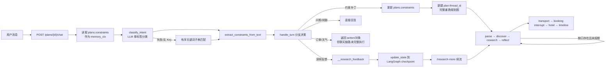
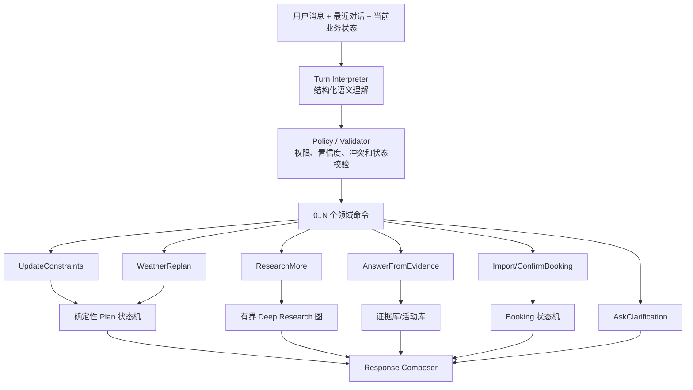
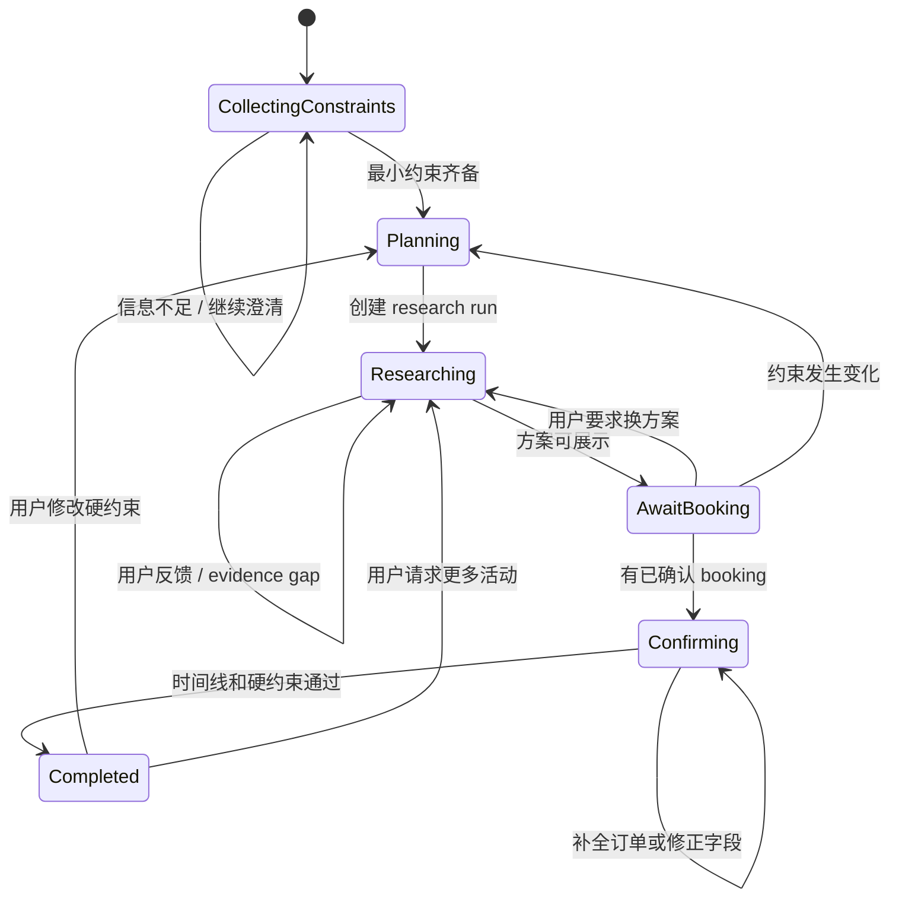
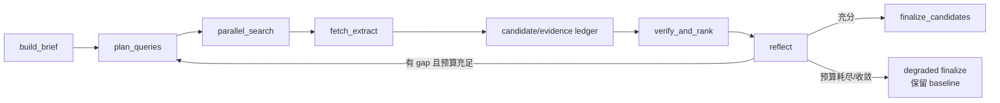

# 对话意图理解与 Deep Research 重构分析设计 v1

> 项目：WhereToGo2（周末去哪儿）
> 日期：2026-07-28
> 状态：已被 `AI原生Agent与DeepResearch开放语义重构_v2.md` 取代；其中领域关键词/标签扩展思路不再采用
> 重点代码：`src/wheretogo/copilot/handle_turn.py`

---

## 1. 结论先行

当前系统**不是完全通过关键词理解用户**，而是采用：

1. LLM 单轮意图分类优先；
2. LLM 失败时使用关键词规则兜底；
3. 约束抽取再独立进行一次 LLM/规则双轨解析；
4. BFF 根据返回结果更新数据库或 LangGraph checkpoint；
5. Deep Research 在规划图内部通过 `research → reflect → research` 形成有界回环。

这个方向作为 MVP 有合理性，但当前实现存在一个本质问题：

> 系统把“有限的业务动作”和“无限的用户表达”都压缩进了单一意图标签，并在降级路径中尝试通过关键词枚举覆盖自然语言。

有限动作可以枚举，例如修改约束、继续研究、查询详情、回填订单；自然语言表达不能靠关键词穷举。否定、组合意图、指代、省略、跨轮回答和中英文混用都会突破词表边界。

本设计建议：

- **保留** LangGraph 的确定性规划骨架、证据护栏、检索入库、缓存、并发和有界循环；
- **优先重构** Copilot 对话控制层，使其成为真正有上下文、可持久化、支持多动作的会话状态机；
- **定向重构** Deep Research 的反馈理解、研究充分性判断、全局预算和可观测性；
- **不建议**将整个系统改造成完全自由、由 LLM 任意控制的自主 Agent。

推荐的总体原则是：

> 模型负责把开放语言映射为结构化动作；确定性运行时负责状态、权限、校验、执行、证据和熔断。

---

## 2. 分析范围

### 2.1 重点分析文件

- `src/wheretogo/copilot/handle_turn.py`
- `src/wheretogo/copilot/nlu.py`
- `src/wheretogo/bff/app.py`
- `src/wheretogo/orchestration/state.py`
- `src/wheretogo/orchestration/graph.py`
- `src/wheretogo/orchestration/nodes.py`
- `src/wheretogo/research/brief.py`
- `src/wheretogo/research/service.py`
- `src/wheretogo/research/supervisor.py`
- `src/wheretogo/providers/llm.py`
- `src/wheretogo/providers/ai.py`
- `web/index.html`

### 2.2 对照的开源实现

- LangChain Open Deep Research
- Google Gemini Fullstack LangGraph Quickstart
- GPT Researcher
- OpenAI Agents SDK
- LangGraph 官方持久化与状态管理设计

---

## 3. 当前对话与规划调用链



当前有三个彼此没有完全统一的状态层：

| 状态层 | 当前载体 | 实际作用 |
|---|---|---|
| 对话状态 | 理论上是 `conversation/pending_clarify` | 字段已声明，但聊天入口基本未持久化和消费 |
| 计划状态 | `plans.constraints/stage/thread_id` | 当前聊天多轮中真正使用的主要状态 |
| 执行状态 | LangGraph checkpoint | 保存规划节点输出、interrupt 和研究回环状态 |

因此当前系统更准确的描述是：

> 无上下文或弱上下文的单轮 NLU + 有状态的规划执行流水线。

它还不是统一的“对话状态机驱动规划状态机”。

---

## 4. 当前意图理解机制

### 4.1 单标签分类

`classify_intent()` 把用户消息分成以下标签之一：

- `provide_constraints`
- `clarify_answer`
- `refine_field`
- `deep_research`
- `confirm_booking`
- `ask_info`
- `weather`
- `chitchat`

正常路径由 LLM 分类，但模型只看到**当前消息**，看不到：

- 最近对话；
- 上一轮助手问题；
- `pending_clarify`；
- 当前计划阶段；
- 最近展示了哪些活动；
- 用户说的“第二个”“刚才那个”指向什么；
- 当前是否正在等待 booking；
- 当前 research 是否结束以及为何结束。

LLM 返回值也不是严格结构化输出，只取文本第一个词并检查是否位于 `_VALID` 中。

### 4.2 关键词兜底

LLM 无 Key、超时、接口异常或输出格式不合法时，会执行 `_RULES`：

```python
for intent, kws in _RULES:
    if any(k.lower() in msg for k in kws):
        return intent
```

它具有三个特征：

1. **子串匹配**，没有单词边界、否定关系和上下文；
2. **先匹配先返回**，规则顺序会改变语义；
3. 未匹配时默认 `provide_constraints`，没有 `unknown/ambiguous`。

因为 `providers.llm.chat()` 会吞掉全部异常并返回 `None`，所以这套规则不是纯测试代码，而是模型故障时的真实生产行为。

### 4.3 约束抽取是第二次独立判断

意图分类完成后，系统再调用 `extract_constraints_from_text()`：

- LLM 成功：直接把 LLM 结果视为权威；
- LLM 失败：使用城市、兴趣、数字和日期正则。

分类与抽取不是同一个结构化推理结果，因此可能出现：

- 分类认为应该深研，但消息实际还包含人数或预算变化；
- 分类认为是问答，抽取器认为在新增约束；
- 分类认为是修改，但抽取器无法表达删除、否定或相对修改；
- 一轮触发两次甚至三次 LLM 调用，增加延迟和不一致概率。

目前只对 `ask_info/chitchat` 做约束纠偏，`deep_research` 被明确排除，因此：

> “有没有适合两个人的展”会触发深研，但“两个人”和“展览”可能不会被写入当前计划约束。

---

## 5. 当前状态转移的真实行为

`ROUTE_TABLE` 看起来描述了 LangGraph 驱动方式，但它并不是所有状态转移的唯一执行源。

| 意图 | 声明 action | 当前实际行为 |
|---|---|---|
| `provide_constraints` | `invoke` | 返回 patch；BFF 更新 DB；约束齐备时创建新 thread 并完整重跑 |
| `clarify_answer` | `invoke` | 理论同上，但由于没有历史问题上下文，实际上接近不可达 |
| `refine_field` | `update_state` | 并非局部 update_state，而是修改 DB 后创建新 thread，完整重跑 |
| `deep_research` | `invoke` | 用 `__research_feedback` 伪装成 constraints patch，再注入 checkpoint |
| `confirm_booking` | `resume` | 返回 booking 对象；聊天 BFF/前端没有据此持久化并 resume |
| `ask_info` | `answer` | 查询活动库并返回文本 |
| `weather` | `replan` | 返回“已经调整”的文案，但聊天链路没有真正执行 replan |
| `chitchat` | `answer` | 返回固定问候语 |

因此 `ROUTE_TABLE` 当前更像**描述性元数据**，不是权威的状态机转移表。

### 5.1 `clarify_answer` 几乎不可达

- 关键词规则没有 `clarify_answer`；
- LLM 分类器没有对话历史；
- BFF 没有把 `pending_clarify` 持久化为下一轮解释输入。

即使上一轮问“从哪里出发？”，下一轮用户只答“上海”，系统也只能把它当作普通 `provide_constraints`，而不是明确的待澄清问题回答。

### 5.2 `conversation` 声明但没有形成闭环

`TripPlanState` 和 `Plan` 模型中已经存在 `conversation`，但当前聊天入口：

- 没有持续追加 user/assistant turn；
- 没有将历史对话传给意图模型；
- 没有用 checkpoint 中的 conversation 解决指代；
- 没有形成对话回放和决策审计。

### 5.3 单个 `thread_id` 混合两种职责

当前 `plans.thread_id` 主要表示“规划版本”：

- 约束变化后生成新 thread；
- 新 thread 让 LangGraph 从头重跑，避免旧活动和告警串轮。

但对话记忆需要一个跨计划版本稳定的标识。如果将同一个 `thread_id` 同时视为对话线程，会出现冲突：

- 对话希望保持；
- 规划 checkpoint 希望在约束变化后隔离。

目标架构应拆成：

- `conversation_id`：稳定的用户对话；
- `plan_revision_id`：一次约束快照；
- `research_run_id`：一次研究作业。

---

## 6. 关键词规则的实测反例

以下结果通过当前代码的 `use_llm=False` 路径直接执行得到：

| 输入 | 当前结果 | 根因 |
|---|---|---|
| `这次就算了` | `confirm_booking` | 单字“次”命中订单规则 |
| `下次想去杭州` | `confirm_booking` | “下次”包含“次” |
| `还有两个人` | `deep_research` | “还有”优先于人数约束 |
| `不是杭州，是苏州` | `provide_constraints`，但无 patch | 规则抽取无法理解纠错和否定 |
| `票已经搞定了` | `provide_constraints` | 没有命中“车票/机票/买好”等固定表达 |
| `有没有适合两个人的展` | `deep_research` | 组合意图被压成单标签，人数/兴趣丢失 |
| `show me something different` | `chitchat` | `something` 中包含子串 `hi` |
| `more like the second one` | `provide_constraints` | 英文指代和相似偏好无法理解 |
| `第二个几点开始` | `ask_info` | 没有保存序号到活动实体的指代关系 |

这些问题不能通过继续扩充 `_RULES` 根治，因为自然语言问题不是词表大小问题，而是组合语义问题：

- 否定：“不要改”“不是杭州”；
- 修正：“还是苏州吧”“前面说错了”；
- 组合：“换成展览，再找几个便宜的”；
- 指代：“第二个”“刚才那个”“类似它的”；
- 省略：“周六”“两个人”“不要太远”；
- 当前阶段：“确认”可能是确认约束、订单、方案或付款；
- 语言混用：“more like 第二个，但便宜点”。

---

## 7. 哪些枚举是合理的

### 7.1 合理：枚举业务能力和状态

业务系统最终可执行动作本来就是有限的，应该显式建模：

- 更新约束；
- 删除或清空约束；
- 查询活动详情；
- 请求新一轮研究；
- 导入订单草稿；
- 确认订单；
- 天气重规划；
- 请求澄清；
- 闲聊或拒答。

这些动作需要类型、权限、验证和测试，因此应该枚举。

### 7.2 不合理：把自然语言表面形式等同于动作

不应依靠：

```text
“还有” → deep_research
“次” → confirm_booking
“调整” → refine_field
“什么” → ask_info
```

来决定业务副作用。

关键词更适合以下有限场景：

- 明确格式识别：`G7502`、`MU5101`、ISO 日期；
- 安全或合规硬规则；
- URL、手机号、订单号等结构化模式；
- LLM 完全不可用时的高精度、低召回兜底；
- 测试环境确定性输入。

即使是兜底，也应优先返回 `ambiguous/clarify`，而不是错误执行高成本或有副作用的动作。

---

## 8. 业界开源实现对照

### 8.1 LangChain Open Deep Research

源码：

- <https://github.com/langchain-ai/open_deep_research/blob/main/src/open_deep_research/deep_researcher.py>
- <https://github.com/langchain-ai/open_deep_research/blob/main/src/open_deep_research/state.py>
- <https://github.com/langchain-ai/open_deep_research/blob/main/src/open_deep_research/prompts.py>

核心设计：

1. 主状态继承 `MessagesState`，完整对话历史是一等状态；
2. 澄清节点读取全部 messages，而不是只看最后一句；
3. 使用 Pydantic `ClarifyWithUser`、`ResearchQuestion` 等结构化输出；
4. 将完整消息压缩成 research brief；
5. Supervisor 通过 `ConductResearch`、`ResearchComplete`、`think_tool` 工具调用决定下一步；
6. Researcher 通过搜索工具调用形成 ReAct 循环；
7. Supervisor、Researcher、并发数和工具调用都有显式上限；
8. 最终报告生成与检索执行分离。

值得借鉴的不是“多 Agent”本身，而是：

- 对话历史进入研究 brief；
- 模型输出结构化决策；
- 模型只提出工具调用，运行时负责实际执行；
- 研究完成由语义充分性和预算共同决定。

### 8.2 Google Gemini Fullstack LangGraph

源码：

- <https://github.com/google-gemini/gemini-fullstack-langgraph-quickstart/blob/main/backend/src/agent/graph.py>
- <https://github.com/google-gemini/gemini-fullstack-langgraph-quickstart/blob/main/backend/src/agent/state.py>

核心流程：

```text
generate_query
    ↓ Send 并行
web_research
    ↓
reflection
    ├── is_sufficient=true → finalize_answer
    └── gap 存在 → follow_up_queries → web_research
```

反思结果显式包含：

- `is_sufficient`
- `knowledge_gap`
- `follow_up_queries`
- `research_loop_count`

这比简单判断“结果数量是否达到 3 个”更接近真正的研究充分性。

### 8.3 GPT Researcher

源码：

- <https://github.com/assafelovic/gpt-researcher/blob/master/gpt_researcher/skills/researcher.py>
- <https://github.com/assafelovic/gpt-researcher/blob/master/gpt_researcher/actions/query_processing.py>
- <https://github.com/assafelovic/gpt-researcher/blob/master/gpt_researcher/skills/deep_research.py>

核心设计：

1. 先做初步搜索；
2. 战略模型结合初步结果生成研究大纲和子查询；
3. 子查询通过 `asyncio.gather` 并行执行；
4. Web、本地文档、Hybrid、MCP 等来源策略分离；
5. Source Curator、Context Manager、Writer 分工明确；
6. 深研模式使用 breadth/depth/concurrency 参数控制搜索空间。

它说明研究规划不应只从用户原始词语出发，还应根据首轮搜索结果和已有证据动态调整。

### 8.4 通用 Agent Runtime

OpenAI Agents SDK：

- <https://openai.github.io/openai-agents-python/running_agents/>

典型运行循环：

1. 将输入和上下文交给模型；
2. 模型返回最终回答、工具调用或 handoff；
3. Runtime 校验并执行工具；
4. 工具结果追加到上下文；
5. 再调用模型，直到结束或达到 `max_turns`。

这类 Agent 仍然只有有限工具，但不需要枚举用户的所有说法。模型完成：

```text
无限语言空间 → 有限、类型化的工具调用空间
```

Runtime 则保证工具调用合法、有界、可观测。

---

## 9. 目标架构

### 9.1 总体结构



关键变化：

- 从“单 intent”改成“多个 dialogue acts/commands”；
- 从“当前消息”改成“当前消息 + 会话状态 + 计划状态 + 最近结果”；
- 从“模型直接决定动作字符串”改成“结构化输出 + 确定性 Policy”；
- 从“魔法 patch”改成显式领域命令；
- 从“规划 thread 兼任对话 thread”改成三层 ID。

---

## 10. 建议的数据结构

### 10.1 TurnContext

```python
class TurnContext(BaseModel):
    conversation_id: str
    plan_id: str | None
    plan_revision_id: str | None

    message: str
    recent_messages: list[ConversationMessage]

    stage: Literal[
        "collecting_constraints",
        "planning",
        "researching",
        "await_booking",
        "confirming",
        "completed",
    ]

    pending_clarification: ClarificationRequest | None
    constraints: TripConstraints
    latest_results: list[PresentedResult]
    latest_research_summary: ResearchRunSummary | None
```

`latest_results` 至少保留：

```python
class PresentedResult(BaseModel):
    display_index: int
    entity_type: Literal["activity", "city", "transport", "hotel"]
    entity_id: str
    title: str
```

这样“第二个”“刚才那个展”“类似它的”才能解析成稳定实体引用。

### 10.2 TurnDecision

```python
class TurnDecision(BaseModel):
    acts: list[DialogueAct]
    constraint_ops: list[ConstraintOperation] = []

    research_request: ResearchRequest | None = None
    info_request: InfoRequest | None = None
    booking_submission: BookingSubmission | None = None
    weather_request: WeatherRequest | None = None

    references: list[ResolvedReference] = []
    clarification: ClarificationDecision | None = None

    confidence: float
    evidence_spans: list[str] = []
```

建议的 `DialogueAct`：

```python
DialogueAct = Literal[
    "update_constraints",
    "request_research",
    "ask_information",
    "submit_booking",
    "confirm_booking",
    "request_replan",
    "answer_clarification",
    "smalltalk",
    "cancel",
    "unknown",
]
```

保留有限动作枚举，但不再枚举语言关键词。

### 10.3 ConstraintOperation

不能继续使用简单字典覆盖，因为用户需求包含增、删、替换和清空：

```python
class ConstraintOperation(BaseModel):
    op: Literal["set", "add", "remove", "clear"]
    field: Literal[
        "origins",
        "target_city",
        "party_size",
        "budget",
        "interests",
        "dietary",
        "date_window",
        "indoor_preference",
    ]
    value: Any | None
```

示例：

> 不想看演唱会了，换成展览，再找几个便宜的。

应生成：

```json
{
  "acts": ["update_constraints", "request_research"],
  "constraint_ops": [
    {"op": "remove", "field": "interests", "value": "演唱会"},
    {"op": "add", "field": "interests", "value": "展览"},
    {"op": "set", "field": "budget", "value": {"preference": "lower"}}
  ],
  "research_request": {
    "mode": "new_revision",
    "novelty_required": true
  }
}
```

### 10.4 DomainCommand

Interpreter 的结果不能直接修改数据库，应先转换成领域命令：

```python
DomainCommand = (
    UpdateConstraints
    | StartPlanRevision
    | ResearchMore
    | AnswerFromEvidence
    | ImportBookingDraft
    | ConfirmBooking
    | ResumePlan
    | ReplanForWeather
    | AskClarification
    | NoOp
)
```

Policy 层负责：

- 校验当前 stage 是否允许该命令；
- 解决多命令执行顺序；
- 对低置信度高副作用命令要求确认；
- 防止模型直接写内部字段；
- 确定是否新建 plan revision；
- 确定调用哪个子图或服务。

---

## 11. 建议的对话状态迁移



### 11.1 澄清策略

澄清不应依赖 `clarify_answer` 分类，而应优先检查：

1. 当前是否存在 `pending_clarification`；
2. 用户消息是否能填充该槽位；
3. 是否同时包含其他命令；
4. 是否需要取消或修正原问题。

例如：

```text
助手：从哪里出发？
用户：上海，两个人，预算一千，最好室内。
```

这一轮应同时：

- 回答 origin 澄清；
- 写入 party size；
- 写入 budget；
- 写入 indoor preference；
- 在约束齐备时启动规划。

---

## 12. 安全降级设计

### 12.1 LLM 正常

使用真正的 JSON Schema/structured output 或 function calling：

- Pydantic 校验；
- 2～3 次格式重试；
- 输出字段枚举；
- 不允许模型输出内部 DB 字段；
- 保存模型、prompt version、耗时和校验结果。

### 12.2 LLM 不可用

关键词兜底应遵循“高精度优先”：

- 明确车次号或航班号 → booking draft；
- 明确 ISO 日期/人数/预算格式 → 约束 patch；
- 明确 URL → 导入/核实；
- 其他情况 → `unknown` 或提出澄清。

不允许以下宽泛词直接触发副作用：

- `次`
- `确认`
- `还有`
- `什么`
- `hi`
- `不要`
- `调整`

### 12.3 观测字段

每轮保存：

```json
{
  "interpreter": "llm_structured | deterministic | fallback_unknown",
  "model": "provider/model",
  "prompt_version": "turn-interpreter-v1",
  "latency_ms": 310,
  "confidence": 0.91,
  "validation_errors": [],
  "commands": ["UpdateConstraints", "ResearchMore"],
  "fallback_reason": null
}
```

不能再把所有异常伪装成 `chitchat`。

---

## 13. Deep Research 当前实现评价

### 13.1 值得保留

1. `research → reflect` 显式条件回环；
2. 最大循环数熔断；
3. 并行搜索与并行入库；
4. 单次 `deadline`；
5. provider 失败降级；
6. 空结果不缓存；
7. query hash 已包含反馈、follow-up queries 和排除项；
8. 已展示活动 ID/标题排除；
9. 跨来源活动实体去重；
10. 时间窗口硬过滤；
11. 只从可信 verification status 召回；
12. 用户反馈后的 baseline 保底；
13. Research Job 和缓存表提供了一定可观测性。

这些是该项目的重要资产，不应在重构时推翻。

### 13.2 主要问题

#### 13.2.1 研究触发依赖单轮意图

用户反馈能否进入研究回环，首先取决于 `classify_intent()` 是否识别为 `deep_research`。

如果表达是：

- “第二个不错，找点类似但便宜的”
- “这批都太远”
- “适合小孩，但不要商场里的”

当前关键词和单标签机制都不稳定。

#### 13.2.2 反馈再次被压成关键词类别

`_FEEDBACK_KINDS` 只覆盖演唱会、演出、展览、市集、亲子、美食等少量类别。

它无法结构化表达：

- 太贵；
- 太远；
- 时间不合适；
- 想要室内；
- 不要商业化；
- 类似第二个；
- 更小众；
- 无障碍；
- 适合老人；
- 不要重复场馆；
- 需要官方可购票。

#### 13.2.3 研究充分性过于简单

当前外层反思大致依赖：

- 是否已有至少 3 个活动；
- 是否找到新候选；
- 是否达到最大循环数。

内部研究环覆盖度主要是：

```text
有搜索结果的 topic 数 / topic 总数
```

这不能回答：

- 候选是否真正满足用户反馈；
- 是否比 baseline 更优；
- 官方或一手证据是否充分；
- 关键字段是否齐全；
- 多个来源是否在说同一个活动；
- 再搜索一轮是否仍有边际收益。

#### 13.2.4 两层循环预算没有统一

当前存在：

1. LangGraph `research → reflect` 循环；
2. 每次 `deep_research()` 内部的多轮查询循环。

每次进入 `deep_research()` 都重新计算 time budget，因此一次用户请求的总耗时可能是单次预算的倍数。

#### 13.2.5 `supervisor` 名称与能力不一致

当前 `run_research_loop()` 主要执行固定流程：

- 拆 topic；
- 双角度搜索；
- 入库；
- 交叉验证；
- 覆盖不足时给 topic 添加固定后缀。

它是一个有界并行执行器，不是会根据研究发现重新分解问题、判断 gap、调整来源策略的动态 Supervisor。

#### 13.2.6 指标在层间丢失

`DeepResearchResult` 已包含：

- `official_count`
- `source_count`
- `termination`
- `status`

但 `_DeepResearchGate.run()` 向图状态返回时只保留部分字段，导致外层反思和 UI 无法利用完整研究质量指标。

#### 13.2.7 其他工程风险

- 查询中硬编码 `2026`，跨年后错误；
- deadline 后无法强杀运行中的线程，后台任务可能继续入库；
- 深研 gate 调用 `needs_deep_research()` 时没有传 intent，实际更接近“只要进入 research 节点且开关/Key 可用就执行”；
- 交叉验证异常大量静默吞掉；
- 当前 job/candidate/evidence 缺少统一的研究 run 关联。

---

## 14. Deep Research 目标设计

### 14.1 Research Brief

用户反馈不应只保存为原始文本，应转换为结构化 brief：

```python
class ResearchBrief(BaseModel):
    city_code: str
    date_window: DateWindow

    include_preferences: list[Preference]
    exclude_preferences: list[Preference]
    hard_constraints: list[Constraint]
    soft_constraints: list[Constraint]

    referenced_result_ids: list[str]
    excluded_entity_ids: list[str]
    excluded_titles: list[str]

    desired_count: int
    novelty_required: bool
    evidence_policy: EvidencePolicy

    user_feedback: str | None
```

### 14.2 Research Plan

```python
class ResearchPlan(BaseModel):
    subqueries: list[ResearchSubquery]
    source_strategies: list[SourceStrategy]
    verification_tasks: list[VerificationTask]
    stop_policy: StopPolicy
```

查询规划应考虑：

- 当前已有候选；
- baseline 未满足的具体原因；
- 已使用查询；
- 已访问 URL；
- source 类型覆盖；
- 尚缺字段；
- 用户明确排除项。

### 14.3 Candidate/Evidence Ledger

不要让搜索结果直接等同于候选活动。建议增加研究账本：

```python
class CandidateEvidence(BaseModel):
    entity_key: str
    candidate_id: str | None

    claims: list[EvidenceClaim]
    source_urls: list[str]
    source_types: list[str]

    matched_hard_constraints: list[str]
    violated_hard_constraints: list[str]
    matched_preferences: list[str]

    evidence_quality: float
    relevance_score: float
    novelty_score: float
```

确定性硬规则继续负责：

- 城市；
- 时间窗口；
- verification status；
- 过期时间；
- 实体去重；
- 明确价格上限；
- 明确排除活动；
- 必要字段合法性。

语义模型或 reranker 负责：

- 小众、氛围、亲子友好等开放偏好；
- “类似第二个”；
- 软约束匹配；
- 研究 gap 判断。

### 14.4 Structured Reflection

```python
class ResearchReflection(BaseModel):
    is_sufficient: bool

    criteria_coverage: float
    hard_constraint_pass_rate: float
    official_source_ratio: float
    evidence_quality: float
    novel_entity_count: int
    marginal_gain: float

    unresolved_gaps: list[str]
    next_queries: list[ResearchSubquery]
    next_source_strategies: list[SourceStrategy]

    stop_reason: Literal[
        "sufficient",
        "budget_exhausted",
        "converged",
        "no_sources",
        "no_better_alternatives",
        "cancelled",
        "failed",
    ]
```

继续研究应同时满足：

```text
存在关键 gap
AND 尚未超全局时间/成本/轮数预算
AND 最近一轮仍有足够边际收益
AND 新查询与历史查询不重复
```

### 14.5 全局 Research Budget

```python
class ResearchBudget(BaseModel):
    deadline_at: datetime
    max_search_calls: int
    max_fetch_calls: int
    max_llm_calls: int
    max_cost: float | None
    max_rounds: int
    cancellation_token: str
```

该预算从一次 `research_run` 开始到结束都保持不变，外层 reflect 和内层查询执行共享。

### 14.6 推荐的研究图



不需要一开始就引入大量子 Agent。对于本项目，较合适的是：

- 一个结构化 Research Planner；
- 多个并行搜索/抽取 worker；
- 一个确定性 Evidence Validator；
- 一个结构化 Research Evaluator；
- 一个候选排序与结果组装器。

---

## 15. BFF 与前端接口建议

### 15.1 移除魔法字段

不再使用：

```json
{"constraints_patch": {"__research_feedback": "..."}}
```

改为：

```json
{
  "commands": [
    {
      "type": "research_more",
      "feedback": "...",
      "mode": "incremental"
    }
  ]
}
```

### 15.2 统一下一步执行描述

当前前端需要理解：

- `auto_stream`
- `restart_stream`
- `ready_to_plan`

建议后端统一返回：

```json
{
  "reply": "已更新偏好，正在重新调研。",
  "state": {
    "conversation_stage": "researching",
    "plan_revision": "rev-3"
  },
  "next_run": {
    "run_id": "research-123",
    "kind": "research",
    "stream_url": "/research-runs/research-123/stream"
  }
}
```

前端只负责连接明确的 run，不需要理解后端内部状态机细节。

### 15.3 booking/weather 真正闭环

- `submit_booking`：只生成草稿，不自动声称已确认；
- `confirm_booking`：用户明确确认字段后才落库；
- `resume_plan`：由命令执行器调用 LangGraph resume；
- `weather_replan`：必须实际 update state/replan 后才能回复“已调整”；
- 执行失败时回复应反映真实状态。

---

## 16. 分阶段迁移方案

### Phase 0：观测与基线

目标：先知道当前系统如何误判。

- 给每轮增加 interpretation source、fallback reason、模型、耗时和 action 日志；
- 建立真实/合成对话语料；
- 统计 intent confusion、fallback rate、无 patch 率、错误副作用率；
- 记录 Deep Research 每轮查询、来源、候选、终止原因和总耗时；
- 不改变现有用户行为。

### Phase 1：统一 Turn Interpreter

目标：替换 `classify_intent + extract_constraints` 的双调用。

- 新增 Pydantic `TurnDecision`；
- 输入最近对话、stage、pending clarification、当前约束、最近结果；
- 支持多 act 和 ConstraintOperation；
- 旧 `handle_turn` 作为 feature flag fallback；
- 低置信度只澄清，不执行副作用。

### Phase 2：会话状态真正持久化

目标：支持跨轮指代和澄清。

- 增加稳定 `conversation_id`；
- 持久化 user/assistant turns；
- 持久化 `pending_clarification`；
- 保存 last presented results；
- 将 `plan_revision_id` 与 conversation 分离；
- 增加 turn replay 和 decision audit。

### Phase 3：显式 Command/Policy 层

目标：统一状态迁移。

- 替换 `ROUTE_TABLE` 的描述性 action；
- 移除 `__research_feedback`；
- BFF 根据 typed command 执行；
- 打通 booking 和 weather 的真实状态转移；
- 对同一 conversation/plan 加并发控制和幂等键。

### Phase 4：Deep Research Evaluator

目标：把数量回环升级为质量/gap 回环。

- 增加结构化 Research Brief；
- 增加 Candidate/Evidence Ledger；
- 增加 structured reflection；
- 统一外层/内层预算；
- 完整透传 source、official、termination 和 quality metrics；
- 使用动态年份和 cancellation。

### Phase 5：删除危险关键词

目标：关键词只保留高精度确定性解析。

- 删除宽泛子串；
- 未知输入返回 clarify；
- 保留订单号、车次号、航班号、URL、日期和数字等格式规则；
- 对无 LLM 环境建立独立的“有限能力模式”产品提示。

---

## 17. 测试与验收

### 17.1 对话理解测试集

至少覆盖：

- 同义改写；
- 否定；
- 修正；
- 多动作组合；
- 中英文混用；
- 指代；
- 省略；
- 上一轮澄清回答；
- 当前 stage 不同；
- 与推荐结果的序号引用；
- 越界/闲聊；
- LLM 不可用；
- 模型输出格式错误。

### 17.2 Metamorphic Tests

比单一固定句测试更重要：

- 添加“麻烦、请、谢谢”不应改变命令；
- 同义改写应保持相同命令；
- 加入否定词应改变对应 operation；
- 替换序号应解析到不同实体；
- 中英文表达应保持同一语义；
- 句中包含 `hi` 子串不应变成问候；
- “下次”不应命中车次；
- 一个消息可稳定输出多个 command。

### 17.3 状态机测试

- 每个 stage 的合法/非法 command；
- conversation 与 plan revision 隔离；
- checkpoint resume；
- 重复请求幂等；
- 并发 chat 与 stream；
- booking 未确认不得进入事实时间线；
- weather 未实际 replan 不得声称已调整。

### 17.4 Deep Research 指标

建议验收指标：

| 维度 | 指标 |
|---|---|
| 约束遵循 | hard constraint pass rate |
| 新颖性 | 相对 baseline 的 distinct entity 数 |
| 相关性 | 用户偏好匹配评分 |
| 证据 | 官方/一手来源比例、关键字段证据覆盖 |
| 研究效率 | 每轮新增有效候选、边际收益 |
| 性能 | P50/P95 总耗时 |
| 成本 | 每个 research run 的 search/LLM 调用和费用 |
| 稳定性 | timeout、partial、failed 比例 |
| 用户反馈 | 接受率、再次“换一批”比例 |

### 17.5 高副作用精度

以下动作的 precision 应接近 100%：

- 确认 booking；
- 覆盖/清空约束；
- 创建新 plan revision；
- 天气重规划；
- 触发高成本 Deep Research；
- 向外部服务写入或发送。

宁可澄清，也不要误执行。

---

## 18. 预期文件拆分

建议逐步拆分为：

```text
src/wheretogo/copilot/
├── turn_context.py
├── turn_schema.py
├── interpreter.py
├── deterministic_fallback.py
├── policy.py
├── commands.py
├── command_executor.py
├── response_composer.py
└── conversation_store.py

src/wheretogo/research/
├── brief.py
├── planner.py
├── executor.py
├── evidence_ledger.py
├── evaluator.py
├── budget.py
├── service.py
└── schemas.py
```

现有 `handle_turn.py` 在迁移完成后只保留门面：

```python
def handle_turn(context: TurnContext) -> TurnResult:
    decision = interpreter.interpret(context)
    commands = policy.resolve(context, decision)
    outcomes = executor.execute(commands)
    return response_composer.compose(context, decision, outcomes)
```

---

## 19. 最终技术判断

### 19.1 是否需要重构 `handle_turn.py`

需要，而且优先级高。

不是因为代码中出现关键词就一定错误，而是因为当前：

- 单轮分类没有真实会话上下文；
- 单标签无法表示组合需求；
- 分类与抽取相互独立；
- 失败静默切换到高误判规则；
- conversation/pending state 没有闭环；
- 部分 action 没有真正执行；
- 状态转移散落在 handler、BFF、前端和 LangGraph 中。

### 19.2 是否需要重写 Deep Research

不需要全部重写，建议增量重构。

应该保留：

- 检索与实时入库；
- 证据体系；
- 可信状态过滤；
- 缓存；
- 并行执行；
- deadline；
- entity dedup；
- baseline fallback；
- LangGraph 回环。

应该替换或增强：

- 用户反馈结构；
- gap 生成；
- 研究充分性；
- 全局预算；
- 指标透传；
- cancellation；
- 自适应查询规划。

### 19.3 是否应该引入完全自主多 Agent

现阶段不建议。

WhereToGo2 是强领域、强约束、强证据要求的旅行决策产品。完全自由的 Agent 会带来：

- 行为不可预测；
- 调试困难；
- 成本扩大；
- 状态一致性风险；
- 证据等级被绕过；
- booking 和重规划等副作用难控制。

更适合的架构是：

> 有上下文的结构化语义理解 + Typed Command + 确定性领域状态机 + 有预算的自适应研究环。

这既能覆盖开放语言，又能保留项目当前最有价值的确定性、证据和可恢复能力。

---

## 20. 参考资料

1. LangChain Open Deep Research
   <https://github.com/langchain-ai/open_deep_research>
2. Open Deep Research 主图实现
   <https://github.com/langchain-ai/open_deep_research/blob/main/src/open_deep_research/deep_researcher.py>
3. Open Deep Research 状态定义
   <https://github.com/langchain-ai/open_deep_research/blob/main/src/open_deep_research/state.py>
4. Google Gemini Fullstack LangGraph Quickstart
   <https://github.com/google-gemini/gemini-fullstack-langgraph-quickstart>
5. Google research graph
   <https://github.com/google-gemini/gemini-fullstack-langgraph-quickstart/blob/main/backend/src/agent/graph.py>
6. GPT Researcher
   <https://github.com/assafelovic/gpt-researcher>
7. GPT Researcher ResearchConductor
   <https://github.com/assafelovic/gpt-researcher/blob/master/gpt_researcher/skills/researcher.py>
8. OpenAI Agents SDK：Running Agents
   <https://openai.github.io/openai-agents-python/running_agents/>
9. LangGraph Persistence
   <https://docs.langchain.com/oss/python/langgraph/persistence>
10. LangGraph Thinking in LangGraph
    <https://docs.langchain.com/oss/python/langgraph/thinking-in-langgraph>

---

## 21. 2026-07-29 落地实现记录

本节记录本方案在分支 `codex/conversation-deep-research-refactor` 的第一阶段实现结果，
避免“设计文档”和实际代码长期漂移。

### 21.1 已落地的对话架构

新增：

- `src/wheretogo/copilot/turn_schema.py`
  - `TurnDecision`
  - `ConstraintOperation`
  - `TurnCommand`
- `src/wheretogo/copilot/interpreter.py`
  - 把最近对话、当前约束、阶段、待澄清槽位一起交给结构化解释器；
  - 支持一轮多个 `acts`，不再强迫用户输入只能对应一个标签；
  - LLM 失败时使用确定性规则降级；
  - 能把“上海”这类短回答绑定到上一轮待澄清的 `origins`；
  - 规则只承担安全兜底和格式归一，不再被视为完整语言空间。

`handle_turn.py` 继续兼容旧的 `intent/action/constraints_patch`，同时新增：

- `acts`
- `commands`
- `turn_decision`

例如“目的地改杭州，顺便查莫奈展门票”可以同时产生：

```json
{
  "acts": ["update_constraints", "answer_info"],
  "commands": [
    {"type": "update_constraints"},
    {"type": "answer"}
  ]
}
```

这里保留了 legacy intent 的兼容行为，但新代码不应再把 legacy intent 当作完整决策。

订单处理同时修正为：

- 对话中识别出的订单只是 `draft`；
- 不再由抽取器自行调用 `confirm_booking`；
- 必须经过用户逐字段确认，才允许成为 `confirmed_by_user` 事实。

天气处理也不再声称“已经调整”：

- 解释层只产生 `request_weather_replan`；
- BFF 返回明确的 `next_run`；
- 真正重规划仍由编排接口执行。

### 21.2 已落地的会话状态闭环

BFF 现在：

- 从 `plans.conversation` 读取最近对话；
- 把最近 assistant 保存的 `pending_clarify` 注入下一轮；
- 尝试从当前 checkpoint 注入最近活动标题和研究结果；
- 每轮保存 user/assistant 两条消息；
- 保存 intent、acts 和 pending clarification 摘要；
- 最多保留最近 40 条，控制 prompt 与 JSONB 体积；
- 返回稳定的 `conversation_id` 和 `plan_revision`。

因此 `conversation` 不再只是 schema 中声明但运行时不用的字段。

### 21.3 已落地的 Deep Research 改造

新增 `src/wheretogo/research/schemas.py`，研究质量不再只有“结果数量”，而是显式记录：

- `activity_count`
- `distinct_entity_count`
- `evidence_count`
- `source_count`
- `official_count`
- `query_count`
- `round_count`
- `coverage`
- `marginal_gain`
- `termination`
- `gaps`
- `sufficient`

Supervisor 和 Service 已经把这些指标逐层透传到 LangGraph research state。

同时完成：

- 查询中的年份改为目标周末年份，不再硬编码 2026；
- `run_research_loop` 支持调用方传入剩余预算；
- 一个 research feedback 回环共享同一总预算起点；
- 预算耗尽时显式写入 `budget_exhausted` 并停止；
- reflection 写入 `research_quality` 与 `research_stop_reason`；
- 停止原因区分 `quality_sufficient`、`personalized_rerank`、`max_loops`、
  `budget_exhausted` 和 `continue_for_gap`；
- BFF 的 broad fallback 增加异常日志，不再完全静默。

### 21.4 兼容策略

这次没有一次性删除关键词规则，原因不是认可“关键词覆盖全部语言”，而是：

- 无模型、模型超时和测试环境仍需要确定性降级；
- 既有前端仍依赖 `intent/action/auto_stream/restart_stream`；
- 渐进迁移比一次性替换整个状态机风险更低。

新旧权威关系应明确为：

1. `TurnDecision.acts/commands` 是新语义契约；
2. `intent/action` 是兼容投影；
3. 关键词规则是 fallback；
4. BFF/Executor 决定是否执行有副作用命令；
5. LangGraph 状态和数据库是持久状态事实。

### 21.5 验证结果

实现后完成：

- Ruff：`src`、`tests` 全量通过；
- Pytest：`324 passed`；
- 对话与 Deep Research 核心回归：`167 passed`；
- 新增混合意图、待澄清短回答、订单草稿、会话持久化、天气命令、
  研究质量正反例测试；
- 真实 Uvicorn HTTP 冒烟：
  - 检测到启动时 8000 已被占用，按约定改用 8001；
  - `GET /health` 返回 `{"ok": true}`；
  - 创建 plan 成功；
  - “再找一批更小众的演唱会”返回
    `update_constraints,research_more` 两个 acts 和两个 commands；
  - 返回 `conversation_id`、`turn_decision` 与 `next_run`。

### 21.6 下一阶段仍建议继续做的事项

第一阶段已经修正核心架构，但以下工作不宜伪装成已经完成：

- 将所有前端动作统一迁移为消费 `next_run/commands`，最终移除散落的布尔标志；
- 引入离线语义评测集、LLM judge 和线上 trace 指标；
- 对运行中的网络请求增加 cooperative cancellation，而不只是取消未启动 Future；
- 把 gap planner 从字符串查询升级为结构化 hypothesis/source plan；
- 在数据规模足够后，用实际成功率/延迟/成本校准研究充分性阈值；
- 完成旧 `ROUTE_TABLE` 和 magic field `__research_feedback` 的最终下线。
