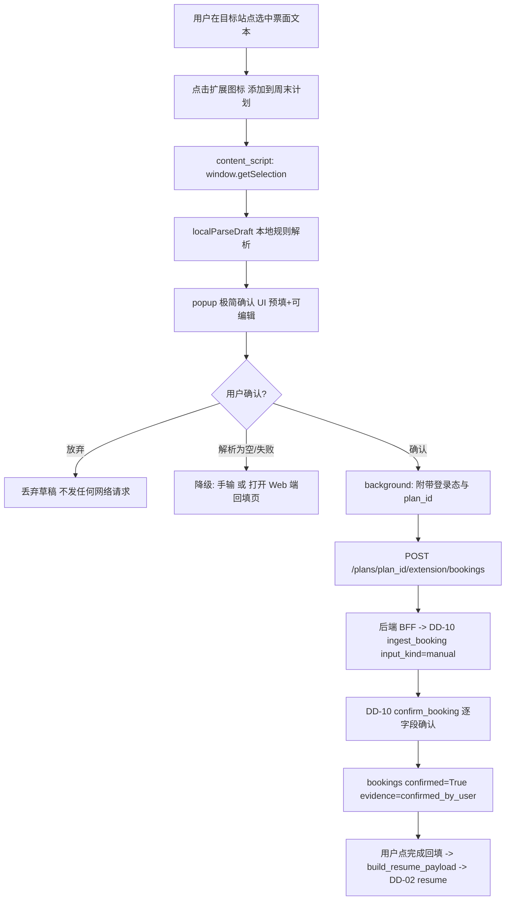

# DD-14 浏览器扩展（MV3）· 详细设计

**详细设计系列 · 领域模块文档 · v0.2 · 2026 年 7 月**

> 本文定义「周末去哪儿」的**浏览器扩展（Manifest V3）**：用户在 12306 / 航司 / OTA / 酒店页浏览时，点"添加到周末计划"，扩展的 content script **只读用户当前查看并主动选择的字段**（`window.getSelection()`），在**本地**生成结构化草稿（`localParseDraft`，纯本地正则/规则，不联网、不调 LLM），经用户在**极简确认 UI** 逐字段核对后，才 `POST` 到后端，进入 **DD-10 同一条 `ingest_booking` 管道 + `confirm_booking` 确认闭环**。这是 DD-10 "回填三入口"之外的**第四种采集通道**，但**完全复用 DD-10 的抽取 schema、确认闭环与写库路径**，不新建数据模型。
>
> **产品定位（务必牢记）**：扩展是**增强而非依赖**——没有扩展，用户依旧能用 DD-10 的文本/截图/链接/手输回填完成一切；扩展只把"回填"从**一分钟缩短到一秒**。**隐私第一**：不自动登录、不模拟购票、不读密码与支付信息、不后台批量抓取、默认本地解析、用户确认后才提交。本模块属 **v0.2**（PRD 路线图 v0.2「浏览器扩展快速回填」）。
>
> **上游依据**：DD-10（`ingest_booking`/`confirm_booking` 契约、`bookings.extracted` schema §3.2/§3.3、resume 注入 §5.5、隐私 §9、DD-14 复用条 §6）、DD-04（`localParseDraft` 只做本地初步解析；提交后端后的抽取走 DD-04 `extract_fact`，禁裸调 LLM）、DD-03（确认后经 `enforce_provenance(field,'user_provided')` → `confirmed_by_user`；`train.*/flight.*` 禁编）、技术架构 v1（§9.8 浏览器扩展 MV3、§11 部署"Chrome MV3 content script 隐私优先"）、PRD 对外版（07 浏览器扩展五条隐私铁律、路线图 v0.2）。
> **下游消费者**：DD-10（复用其管道写 `bookings`）、DD-02（确认后经 `build_resume_payload` → `Command(resume)`）、Web 端（plan 关联、登录态传递、回填页降级回落）。
> **一句话**：**扩展只读你选中的、只在本地解析、只在你确认后提交；提交之后，与手输回填走同一条不可信抽取 → 用户确认 → 才入库的路径。**

---

## 1. 模块职责与边界（增强非依赖，v0.2）

| 项 | 说明 |
|---|---|
| **职责** | 提供一个可选的 MV3 浏览器扩展：在目标站点采集**用户主动选中**的凭证字段，**本地**解析为结构化草稿，用户极简确认后 `POST` 进 DD-10 `ingest_booking` 管道，实现"秒级回填"。 |
| **边界内** | ① MV3 工程结构（manifest / content script / background service worker / popup 确认 UI）；② `localParseDraft` 本地纯规则解析（train/flight/hotel）；③ 与后端 BFF 的提交契约（对齐 DD-10 payload）；④ 登录态 / `plan_id` 关联；⑤ 目标站点白名单与最小权限清单；⑥ 解析失败降级（手输 / 回落 Web 端回填）。 |
| **边界外** | ① **抽取/OCR/LLM 原子能力**（DD-04 提供，扩展本地解析只做"初步"，提交后端后的精抽取走 DD-04，扩展**不得**在浏览器里调 LLM）；② **确认后写库、resume 组装**（DD-10 / DD-02 负责，扩展只是入口）；③ **证据定级**（DD-03 `enforce_provenance`，扩展不构造 `confirmed` 状态）；④ 时间线、交通策略等一切业务编排。 |
| **架构位置** | 技术架构 v1 §4.1 客户端层"可选浏览器扩展(MV3)"；采集入口，落到 DD-10 领域服务之前，与 Web 端回填页平级、共享后端契约。 |
| **增强非依赖的工程含义** | 扩展与 Web 端**同契约**：扩展提交的 payload 与 Web 端回填页提交的 payload 结构一致（§4.4）；关掉扩展，Web 端回填页完整可用；扩展任何失败都可**一键回落 Web 端回填**（§8）。 |

**在采集链路中的位置**：

```text
[用户在 12306/航司/OTA/酒店页浏览，选中票面文本]
  ↓ 点扩展图标 → "添加到周末计划"
content script: window.getSelection() 取选中文本（仅此，不读整页 DOM）
  ↓ localParseDraft(text) —— 纯本地正则/规则，不联网、不调 LLM
popup: 极简确认 UI（预填字段 + 逐字段可编辑 + 低置信标黄）
  ↓ 用户确认（这一步 = DD-10 的"用户确认"动作）
background: fetch POST /api/v1/plans/{plan_id}/extension/bookings（带登录态）
  ↓ 后端 BFF → DD-10 ingest_booking(input_kind='manual') → confirm_booking
bookings(confirmed=True, evidence=confirmed_by_user)
  ↓ 用户点"完成回填" → build_resume_payload → DD-02 Command(resume)
```

**设计原则**：① **只处理选中内容**——`window.getSelection()` 是唯一数据源，绝不遍历 DOM、绝不读表单/输入框/cookie；② **本地优先**——`localParseDraft` 在浏览器本地完成，网络只在"用户确认后提交"时发生一次；③ **同一条管道**——提交后完全走 DD-10，扩展不新建 schema、不新建确认逻辑、不新建写库路径；④ **最小权限**——`host_permissions` 只申请白名单域名，`activeTab` 让扩展仅在用户点击时对当前标签页生效。

---

## 2. 设计目标与非目标

**目标**：
1. **秒级回填**：在目标站点选中票面 → 点图标 → 确认 → 提交，中位耗时 ≤ 3s（对比 DD-10 手输一分钟、截图十秒）。
2. **零新增契约**：提交完全复用 DD-10 `ingest_booking`/`confirm_booking`，`extracted` schema 与 §3.3 一致；后端无需为扩展新建领域逻辑。
3. **隐私铁律工程化**：五条铁律（§7）写进权限清单、代码审查清单与 CI 静态扫描，可验证、可断言。
4. **增强非依赖**：扩展缺失/失败时，Web 端回填页 100% 覆盖同等能力；任何异常一键回落 Web 端。
5. **本地解析可用**：`localParseDraft` 对 12306/航司/酒店常见票面文本达到"关键字段可预填"，剩余交由用户确认与后端精抽取兜底。

**非目标**：
- ❌ **不做交易**：不自动登录、不模拟购票、不代填表单、不触发任何下单动作（PRD 硬约束①）。
- ❌ **不后台运行**：无 `background` 定时抓取、无 `tabs` 全局监听、无跨标签页数据采集；只在用户显式点击时工作。
- ❌ **不在浏览器里调 LLM/OCR**：`localParseDraft` 仅正则/规则；精抽取一律回后端走 DD-04（避免在客户端泄露 Key、避免不可控成本）。
- ❌ **不读整页/不读敏感字段**：不读密码框、支付信息、cookie、localStorage、账户页 DOM；只读 `getSelection()`。
- ❌ **不做证据定级**：扩展提交的字段来源恒为 `user_provided`，定级由 DD-03 在后端完成，扩展不构造 `confirmed`。
- ❌ **不截图上传**（v0.2）：扩展只走文本选择路径；截图入口仍由 Web 端回填（DD-10 §5.2），避免 `<all_urls>` 截屏权限。

---

## 3. 数据流（选择 → 本地草稿 → 确认 → POST → DD-10）



**关键数据边界**：
- **本地阶段**（C→E）：数据只在浏览器内存，`localParseDraft` 无任何 `fetch`；用户放弃则草稿随 popup 关闭销毁，**零网络请求**。
- **提交阶段**（I→J）：唯一一次出网请求，仅发送**用户已确认的字段**与必要元信息（`plan_id`、目标站点 host、选中长度），**不发送原始整页、不发送 cookie**。
- **后端阶段**（K→M）：完全走 DD-10 —— `ingest_booking` 建行（`confirmed=False`）→ `confirm_booking` 逐字段确认 → 定级 `confirmed_by_user` → 写 `bookings`。扩展不绕过任何 DD-10 步骤。

> **数据最小化**：提交 payload 中 `raw` 字段在 `input_kind='manual'` 时为空串（本地已解析）；若走 `input_kind='text'`（把选中文本交后端精抽取），`raw` 为**用户选中的那段文本**，且经扩展本地 `stripSensitive()` 预清洗（去除疑似证件号/手机号/支付串，§7.3）后才发送，服务端再经 DD-04 `redact()` 二次脱敏。

---

## 4. 接口契约

三层链路：**content script ↔ background（service worker）↔ 后端 BFF**。所有跨层通信用结构化消息，字段严格对齐 DD-10 `extracted.fields`（§3.3）。

### 4.1 content script ↔ background 消息契约（`chrome.runtime` 消息）

```jsonc
// ① background/popup → content script：请求采集当前选择
{ "type": "CAPTURE_SELECTION", "kind_hint": "train" }   // kind_hint 由 host 推断，可空

// ② content script → 调用方：返回本地草稿（不含 evidence，evidence 后端才有）
{
  "type": "SELECTION_DRAFT",
  "ok": true,
  "kind": "train",                 // localParseDraft 推断，用户可在 UI 改
  "source_meta": {
    "host": "kyfw.12306.cn",
    "captured_at": "2026-07-21T10:20:00+08:00",
    "selection_len": 88            // 选中字符数（度量/审计，不含内容）
  },
  "draft": {                       // 对齐 DD-10 §3.3 extracted，但仅 value/evidence_quote/confidence
    "schema_version": "dd10-v1",
    "kind": "train",
    "fields": {
      "train_no":     {"value": "G7016",   "evidence_quote": "G7016",   "confidence": 0.95},
      "from_station": {"value": "上海虹桥", "evidence_quote": "上海虹桥", "confidence": 0.9},
      "to_station":   {"value": "苏州",     "evidence_quote": "苏州",     "confidence": 0.9},
      "date":         {"value": "2026-07-25","evidence_quote":"7月25日", "confidence": 0.85},
      "depart":       {"value": "08:12",    "evidence_quote": "08:12",   "confidence": 0.95},
      "arrive":       {"value": "08:35",    "evidence_quote": "08:35",   "confidence": 0.9},
      "seat_class":   {"value": "二等座",   "evidence_quote": "二等座",   "confidence": 0.8},
      "price":        {"value": "39.5",     "evidence_quote": "¥39.5",   "confidence": 0.7}
    }
  }
}

// 解析为空/失败
{ "type": "SELECTION_DRAFT", "ok": false, "reason": "empty_selection" }   // 或 "parse_failed"
```

> **注意**：本地草稿的 `confidence` 是**规则匹配置信度**，仅用于 UI 标黄提示；它**不等于**证据可信度，后端不信任它，仅作交互提示。`price` 保留原文（"39.5"/"¥39.5"），归一为分由后端 DD-10 `normalize_field` 完成。

### 4.2 background ↔ 后端 BFF：提交契约（对齐 DD-10 ingest）

**Endpoint**：`POST /api/v1/plans/{plan_id}/extension/bookings`
**Auth**：`Authorization: Bearer {token}`（登录态，§6.3 关联机制注入）
**Header**：`X-WTG-Client: extension/0.2.0`（服务端识别来源，用于埋点与限流）

**Request body（扩展提交，一次完成 ingest + confirm）**：

```jsonc
{
  "plan_id": 123,
  "kind": "train",                    // train | flight | hotel
  "input_kind": "manual",             // 见下"两种提交模式"
  "raw": "",                          // manual=空；text=用户选中的那段文本（已本地脱敏）
  "local_draft": {                    // §4.1 draft，作为后端预填提示（manual 模式下作为字段来源）
    "schema_version": "dd10-v1", "kind": "train",
    "fields": { "train_no": {"value":"G7016","confidence":0.95}, "...": {} }
  },
  "confirmed_fields": {               // 用户在扩展极简 UI 逐字段核对/修改后的最终值
    "train_no": "G7016", "from_station": "上海虹桥", "to_station": "苏州",
    "date": "2026-07-25", "depart": "08:12", "arrive": "08:35",
    "seat_class": "二等座", "price": "39.5"
  },
  "source_meta": { "host": "kyfw.12306.cn", "captured_at": "2026-07-21T10:20:00+08:00" }
}
```

**两种提交模式**（由扩展根据本地解析质量选择）：

| 模式 | `input_kind` | `raw` | 后端行为 | 适用 |
|---|---|---|---|---|
| **本地解析模式**（默认） | `manual` | 空串 | `ingest_booking(input_kind='manual')` 建空行 → 用 `local_draft`/`confirmed_fields` 直接确认 | `localParseDraft` 成功，字段齐全 |
| **文本委托模式** | `text` | 用户选中文本（已本地脱敏） | `ingest_booking(input_kind='text')` 走 DD-04 `extract_fact` 精抽取 → 返回 draft 供再确认 | 本地解析不全，交后端小模型补抽 |

> **为何默认 `manual`**：DD-10 §6 复用条明确"扩展在本地生成结构化草稿……走同一 `ingest_booking(input_kind='manual'|'text')` + `confirm_booking`"。`manual` 入口在 DD-10 §5.1 中**无后端抽取**（不计 LLM 成本、不出网调模型），完全由用户确认值成事实，最契合"本地解析 + 用户确认"。仅当本地解析不足时，才退到 `text` 模式借后端小模型补抽（此时会返回 draft，需在扩展/Web 端二次确认）。

**Response（`manual` 模式，已确认 → 直接 confirmed）**：

```jsonc
{
  "booking_id": 456,
  "kind": "train",
  "input_kind": "manual",
  "confirmed": true,                 // 关键字段齐全并确认 → DD-10 置 True
  "evidence": {                      // DD-03 enforce_provenance('train.*','user_provided') 结果
    "source_type": "user_provided",
    "verification_status": "confirmed_by_user",
    "confidence": 1.0,
    "note": "扩展采集·用户逐字段确认"
  },
  "extracted": { "kind": "train", "fields": { "...": {} } },  // 确认后最终值（分为单位）
  "ready_for_resume": true
}
```

**Response（`text` 模式 或 缺关键字段 → 待再确认）**：

```jsonc
{
  "booking_id": 456,
  "kind": "train",
  "input_kind": "text",
  "confirmed": false,
  "status": "needs_review",
  "missing_key_fields": ["depart"],  // DD-10 KEY_FIELDS 缺项
  "draft": { "fields": { "...": {} } },
  "review_url": "https://app.wheretogo/plans/123/bookings/456/review",  // 回落 Web 端回填页
  "ready_for_resume": false
}
```

### 4.3 后端映射到 DD-10 领域服务（BFF 内部，非扩展直接调用）

```python
# bff/routes/extension.py —— 扩展提交端点，薄封装，全部委托 DD-10
from dd10.service import ingest_booking, confirm_booking

async def post_extension_booking(plan_id: int, body: dict, user) -> dict:
    assert body["kind"] in ("train", "flight", "hotel")
    assert_plan_owned_by(plan_id, user)                    # 登录态校验：plan 归属当前用户
    input_kind = body.get("input_kind", "manual")
    assert input_kind in ("manual", "text")                # 扩展只允许 manual/text，禁 image/link

    # ① 建行 + （text 模式下）后端精抽取；manual 模式返回空表单草稿
    raw = redact_text(body.get("raw", "")) if input_kind == "text" else ""  # DD-04 redact 二次脱敏
    ingest = await ingest_booking(plan_id, body["kind"], input_kind, raw)
    booking_id = ingest["booking_id"]

    # ② manual 模式：用户已在扩展确认 → 直接走 DD-10 逐字段确认闭环
    if input_kind == "manual" and body.get("confirmed_fields"):
        return await confirm_booking(plan_id, booking_id,
                                     confirmed_fields=body["confirmed_fields"])
    # ③ text 模式：返回后端抽取草稿，交扩展/Web 端二次确认
    return {**ingest, "review_url": web_review_url(plan_id, booking_id)}
```

> **契约不变量**：扩展**永远不能**直接把记录写成 `confirmed`——`confirmed_by_user` 只能由 DD-10 `confirm_booking` 内部经 DD-03 `enforce_provenance(field,'user_provided')` 产生。扩展只是"用户确认这一动作"的触发者。

### 4.4 与 Web 端回填页的等价契约

扩展 `manual` 提交与 Web 端回填页"手输 + 确认"提交，在后端**归一到同一次** `ingest_booking(input_kind='manual')` + `confirm_booking` 调用。差异仅在 `source_meta.host` 与 `X-WTG-Client` 头（埋点区分来源）。因此：**扩展是 Web 端回填页的一个前置采集加速器，不是独立数据通路**（增强非依赖的契约保证）。

---

## 5. 核心实现

MV3 工程目录：

```text
extension/
├── manifest.json           # MV3 清单（权限最小化）
├── background.js           # service worker：消息路由 + 提交 + 登录态
├── content_script.js       # 只读 getSelection + localParseDraft
├── local_parse.js          # 纯本地规则解析（被 content_script 引入）
├── popup.html / popup.js    # 极简确认 UI
└── icons/                  # 图标
```

### 5.1 `manifest.json`（MV3，最小权限）

```json
{
  "manifest_version": 3,
  "name": "周末去哪儿 · 回填助手",
  "version": "0.2.0",
  "description": "在 12306/航司/OTA/酒店页，选中票面点一下，秒级回填到你的周末计划。仅本地解析你选中的内容，确认后才提交。",
  "minimum_chrome_version": "116",
  "permissions": ["activeTab", "storage", "scripting"],
  "optional_permissions": [],
  "host_permissions": [
    "https://kyfw.12306.cn/*",
    "https://www.12306.cn/*",
    "https://www.ceair.com/*",
    "https://www.airchina.com.cn/*",
    "https://www.csair.com/*",
    "https://www.hnair.com/*",
    "https://*.ctrip.com/*",
    "https://*.trip.com/*",
    "https://*.qunar.com/*",
    "https://hotels.ctrip.com/*",
    "https://*.fliggy.com/*"
  ],
  "background": { "service_worker": "background.js", "type": "module" },
  "action": {
    "default_title": "添加到周末计划",
    "default_popup": "popup.html",
    "default_icon": { "16": "icons/16.png", "48": "icons/48.png", "128": "icons/128.png" }
  },
  "content_scripts": [
    {
      "matches": [
        "https://kyfw.12306.cn/*", "https://www.12306.cn/*",
        "https://www.ceair.com/*", "https://www.airchina.com.cn/*",
        "https://www.csair.com/*", "https://www.hnair.com/*",
        "https://*.ctrip.com/*", "https://*.trip.com/*",
        "https://*.qunar.com/*", "https://*.fliggy.com/*"
      ],
      "js": ["local_parse.js", "content_script.js"],
      "run_at": "document_idle"
    }
  ],
  "externally_connectable": {
    "matches": ["https://app.wheretogo.example/*"]
  },
  "content_security_policy": {
    "extension_pages": "script-src 'self'; object-src 'self'"
  }
}
```

**权限逐条说明（数据最小化）**：
- `activeTab`：仅在用户点击扩展图标时授予当前标签页临时访问权——**用户主动触发才生效**，无常驻权限。
- `storage`：仅存 `plan_id`、登录 token（会话级）、目标站点白名单缓存；**不存任何票面/PII 内容**。
- `scripting`：向当前标签页注入采集消息（配合 `activeTab`）；不用于批量扫描。
- **不申请** `tabs`（无需全局标签页信息）、`<all_urls>`（不越权）、`webRequest`（不拦截请求）、`cookies`（不读 cookie）、`downloads`/`clipboardRead` 等。
- `host_permissions` + `content_scripts.matches` 仅白名单域名；新增站点须评审后加入（§9）。
- `externally_connectable` 仅允许 Web 端官方域向扩展发消息（§6.3 关联），杜绝任意站点通信。

### 5.2 `content_script.js`（只读选中内容）

```javascript
// content_script.js（MV3）—— 唯一数据源 = window.getSelection()，绝不读整页/表单/cookie
// 严格对齐技术架构 v1 §9.8：只处理用户选中的文本，不后台批量抓取。
import { localParseDraft } from "./local_parse.js";   // 纯本地规则，不联网

const HOST = location.hostname;

function inferKind(host) {
  if (host.includes("12306")) return "train";
  if (/ceair|airchina|csair|hnair/.test(host)) return "flight";
  return "hotel"; // ctrip/qunar/fliggy 视场景，用户可在 UI 改
}

chrome.runtime.onMessage.addListener((msg, _sender, sendResponse) => {
  if (msg?.type !== "CAPTURE_SELECTION") return;

  const text = (window.getSelection?.().toString() || "").trim();  // 仅用户选中的内容
  if (!text) {
    sendResponse({ type: "SELECTION_DRAFT", ok: false, reason: "empty_selection" });
    return true;
  }

  try {
    const kind = msg.kind_hint || inferKind(HOST);
    const draft = localParseDraft(kind, text);        // 本地解析成草稿（不出网、不调 LLM）
    sendResponse({
      type: "SELECTION_DRAFT",
      ok: true,
      kind,
      source_meta: { host: HOST, captured_at: new Date().toISOString(),
                     selection_len: text.length },     // 只记长度，不记内容
      draft,
    });
  } catch (e) {
    sendResponse({ type: "SELECTION_DRAFT", ok: false, reason: "parse_failed" });
  }
  return true; // 异步 sendResponse
});
```

> **审查要点**：本文件**不得**出现 `document.querySelector`/`document.forms`/`document.cookie`/`localStorage`/`fetch`/`XMLHttpRequest`。唯一允许的数据入口是 `window.getSelection()`。CI 静态扫描（§7.4）对这些 API 做黑名单断言。

### 5.3 `local_parse.js`（`localParseDraft` 本地规则解析）

```javascript
// local_parse.js —— 纯本地正则/规则解析，零依赖、零网络、零 LLM。
// 目标：把用户选中的票面文本预填为 DD-10 §3.3 fields 结构；解析不了的字段留空交用户。
const RE = {
  trainNo: /\b([GDCZTKY]\d{1,4})\b/,                        // G7016 / D2286 / K123
  flightNo: /\b([A-Z]{2}\d{3,4})\b/,                        // MU5100 / CA1858
  time: /\b([01]?\d|2[0-3])[:：]([0-5]\d)\b/g,              // 08:12
  date: /(\d{4})[-年/.](\d{1,2})[-月/.](\d{1,2})日?|(\d{1,2})月(\d{1,2})日/,
  price: /[¥￥]?\s*(\d+(?:\.\d{1,2})?)\s*元?/,
  seat: /(商务座|一等座|二等座|特等座|硬卧|软卧|硬座|无座)/,
  cabin: /(头等舱|公务舱|商务舱|超级经济舱|经济舱)/,
  room: /(大床房|双床房|标准间|套房|家庭房|豪华.{0,4}房)/,
};
const CN_STATION = /([\u4e00-\u9fa5]{2,10}(?:站|机场|国际机场|T\d)?)/g;

function f(value, quote, confidence) {
  return value == null ? { value: null, confidence: 0 }
                       : { value: String(value), evidence_quote: quote ?? String(value), confidence };
}
function normDate(m) {
  if (!m) return null;
  if (m[1]) return `${m[1]}-${String(m[2]).padStart(2,"0")}-${String(m[3]).padStart(2,"0")}`;
  const y = new Date().getFullYear();                        // "7月25日" 补当年，后端可再校
  return m[4] ? `${y}-${String(m[4]).padStart(2,"0")}-${String(m[5]).padStart(2,"0")}` : null;
}

export function localParseDraft(kind, text) {
  const fields = {};
  const times = [...text.matchAll(RE.time)].map(x => `${String(x[1]).padStart(2,"0")}:${x[2]}`);
  const d = normDate(text.match(RE.date));
  const price = text.match(RE.price)?.[1];

  if (kind === "train") {
    const no = text.match(RE.trainNo)?.[1];
    const stations = [...text.matchAll(CN_STATION)].map(x => x[1]).filter(s => /站|虹桥|南|北|东|西/.test(s));
    Object.assign(fields, {
      train_no:     f(no, no, no ? 0.95 : 0),
      from_station: f(stations[0], stations[0], stations[0] ? 0.8 : 0),
      to_station:   f(stations[1], stations[1], stations[1] ? 0.8 : 0),
      date:         f(d, undefined, d ? 0.85 : 0),
      depart:       f(times[0], times[0], times[0] ? 0.9 : 0),
      arrive:       f(times[1], times[1], times[1] ? 0.85 : 0),
      seat_class:   f(text.match(RE.seat)?.[1], undefined, 0.8),
      price:        f(price, price ? `¥${price}` : undefined, price ? 0.7 : 0),
    });
  } else if (kind === "flight") {
    const no = text.match(RE.flightNo)?.[1];
    Object.assign(fields, {
      flight_no:   f(no, no, no ? 0.95 : 0),
      dep_airport: f(null), arr_airport: f(null),            // 机场名歧义高，留空交用户
      date:        f(d, undefined, d ? 0.85 : 0),
      dep_time:    f(times[0], times[0], times[0] ? 0.9 : 0),
      arr_time:    f(times[1], times[1], times[1] ? 0.85 : 0),
      cabin:       f(text.match(RE.cabin)?.[1], undefined, 0.75),
      baggage:     f(null),
      price:       f(price, price ? `¥${price}` : undefined, price ? 0.7 : 0),
    });
  } else { // hotel
    Object.assign(fields, {
      hotel:      f(null),                                    // 酒店名难以纯规则切分，留空
      area:       f(null),
      check_in:   f(d, undefined, d ? 0.7 : 0),
      check_out:  f(null),
      room:       f(text.match(RE.room)?.[1], undefined, 0.7),
      cancel_policy: f(null),
      price:      f(price, price ? `¥${price}` : undefined, price ? 0.6 : 0),
    });
  }
  return { schema_version: "dd10-v1", kind, fields };
}
```

> **本地解析的定位**：`localParseDraft` **不追求准确率**——它只是把"能一眼规则化的字段"预填，降低用户输入量；解析不到的（如酒店名、机场名）留空由用户填。这与 DD-10 "抽取只是初稿"一脉相承。若字段太少（关键字段命中 < 阈值），扩展改走 `text` 委托模式（§4.2）让后端小模型补抽。

### 5.4 `background.js`（service worker：路由 + 提交 + 登录态）

```javascript
// background.js（MV3 service worker，无常驻、事件驱动）
const API_BASE = "https://api.wheretogo.example/api/v1";

// —— 登录态 / plan_id：由 Web 端经 externally_connectable 注入（§6.3）——
chrome.runtime.onMessageExternal.addListener((msg, sender, sendResponse) => {
  if (msg?.type === "WTG_CONNECT") {                 // 仅 manifest.externally_connectable 白名单域可达
    chrome.storage.session.set({
      token: msg.token, plan_id: msg.plan_id, plan_title: msg.plan_title,
    }).then(() => sendResponse({ ok: true }));
    return true;
  }
});

// —— popup 请求提交草稿 —— 唯一出网点
chrome.runtime.onMessage.addListener((msg, _sender, sendResponse) => {
  if (msg?.type !== "SUBMIT_BOOKING") return;
  (async () => {
    const { token, plan_id } = await chrome.storage.session.get(["token", "plan_id"]);
    if (!token || !plan_id) {
      sendResponse({ ok: false, reason: "not_linked" });   // 未关联 → popup 引导去 Web 端连接
      return;
    }
    try {
      const res = await fetch(`${API_BASE}/plans/${plan_id}/extension/bookings`, {
        method: "POST",
        headers: {
          "Content-Type": "application/json",
          "Authorization": `Bearer ${token}`,
          "X-WTG-Client": "extension/0.2.0",
        },
        body: JSON.stringify(msg.payload),               // §4.2 提交契约
      });
      sendResponse({ ok: res.ok, status: res.status, data: await res.json() });
    } catch (e) {
      sendResponse({ ok: false, reason: "network_error" });
    }
  })();
  return true;
});
```

> **无后台抓取的工程保证**：background 里**没有** `chrome.alarms` 定时器、**没有** `chrome.tabs.onUpdated`/`webNavigation` 监听、**没有**任何主动 `fetch` 目标站点。它只在收到 popup 的 `SUBMIT_BOOKING` 时向**我方后端**发一次请求。

### 5.5 确认 UI（极简 popup）

```javascript
// popup.js —— 极简确认 UI：点击图标 → 采集 → 逐字段可编辑 → 确认提交
async function run() {
  const { plan_id, plan_title } = await chrome.storage.session.get(["plan_id", "plan_title"]);
  if (!plan_id) { showLinkPrompt(); return; }              // 未关联 → 引导去 Web 端"连接扩展"
  renderHeader(plan_title);

  const [tab] = await chrome.tabs.query({ active: true, currentWindow: true });
  const resp = await chrome.tabs.sendMessage(tab.id, { type: "CAPTURE_SELECTION" });

  if (!resp?.ok) { showFallback(resp?.reason); return; }   // 空选择/解析失败 → 降级（§8）

  const { kind, draft, source_meta } = resp;
  renderForm(kind, draft);                                 // 预填 + 逐字段 input（低置信标黄）

  document.getElementById("confirm").onclick = async () => {
    const confirmed_fields = collectForm();                // 读取用户核对/修改后的值
    const payload = {
      plan_id, kind, input_kind: "manual", raw: "",
      local_draft: draft, confirmed_fields, source_meta,
    };
    const r = await chrome.runtime.sendMessage({ type: "SUBMIT_BOOKING", payload });
    if (r?.ok && r.data?.confirmed) showDone("已加入你的周末计划 ✓");
    else if (r?.data?.review_url) openTab(r.data.review_url);  // 缺字段/text 模式 → 回落 Web 端确认
    else showError(r?.reason);
  };
}

function renderForm(kind, draft) {
  const box = document.getElementById("fields"); box.innerHTML = "";
  for (const [name, fld] of Object.entries(draft.fields)) {
    const low = (fld.confidence ?? 0) < 0.75;              // 低置信标黄（对齐 DD-10 LOW_CONF_TH）
    box.insertAdjacentHTML("beforeend", `
      <label class="${low ? "warn" : ""}">
        <span>${FIELD_LABELS[name] ?? name}</span>
        <input name="${name}" value="${fld.value ?? ""}" placeholder="请核对/补充" />
      </label>`);
  }
}
run();
```

UI 原则：**够用即可，不追酷炫**（对齐 DD-03 §7）——单列表单、预填值、低置信标黄、一个"确认加入"按钮、一个"改用网页回填"链接。确认前不发任何请求。

---

## 6. 与其他模块接线

| 模块 | 关系 | 接线点 |
|---|---|---|
| **DD-10**（回填管道） | **复用（核心）** | 扩展提交经 BFF 调 `ingest_booking(input_kind='manual'\|'text')` + `confirm_booking`；`extracted` 严格用 DD-10 §3.3 schema；写库、状态语义、resume 组装全部由 DD-10 完成，扩展不新建 |
| **DD-03**（证据定级） | 依赖 | 确认后每字段经 DD-10 内部 `enforce_provenance(field,'user_provided')` → `confirmed_by_user`；`train.*/flight.*` 值来源恒 `user_provided`，天然过闸三；扩展**不构造** `confirmed` 状态 |
| **DD-04**（AI 能力层） | 依赖（仅 text 模式） | `input_kind='text'` 时后端走 `extract_fact` 精抽取；`raw` 进模型前经 `redact()`；扩展本地 `localParseDraft` **不属于** DD-04，是纯客户端规则，绝不在浏览器调 LLM |
| **DD-02**（编排 resume） | 下游 | 扩展确认的 booking 与其他回填一并由 `build_resume_payload` 汇集 → `POST /plans/{id}/resume` → `Command(resume)`（DD-10 §5.5 / DD-02 §6.2） |
| **Web 端** | 协作 | ① `plan_id`/登录态经 `externally_connectable` 注入（§6.3）；② 缺关键字段/`text` 模式回落 Web 端回填页 `review_url`；③ 契约等价（§4.4） |
| **DD-01**（数据/隐私） | 间接 | 经 DD-10 写 `bookings`；扩展侧遵守 DD-01 §11 PII 不落明文（本地 `stripSensitive` + 后端 `mask_pii`） |

**接线铁律**：扩展是 **DD-10 的一个采集前端**，不是并行数据通路。任何"扩展直接写库""扩展跳过确认""扩展自定义 evidence"都违反接线，CI 契约测试（§10）断言扩展提交必经 `ingest_booking` + `confirm_booking`。

### 6.3 与 Web 端 plan 关联（登录态 / plan_id 传递）

采用 MV3 `externally_connectable` 的**官方域单向注入**，避免扩展读取 cookie 或自行处理登录：

```text
Web 端（已登录，用户打开某 plan）
  ↓ 用户点页面上的"连接浏览器扩展"
window 侧：chrome.runtime.sendMessage(EXTENSION_ID, {
    type: "WTG_CONNECT",
    token: <短时效会话 token>,          // 后端签发，作用域限该 plan 的回填
    plan_id: 123, plan_title: "7/25 苏州周末"
})
  ↓ 仅 manifest.externally_connectable.matches 命中的官方域可达
background.onMessageExternal → chrome.storage.session 暂存（会话级，浏览器关闭即清）
```

- **登录态**：扩展**不自行登录、不读密码**（铁律）；token 由 Web 端在用户已登录会话下签发并注入，`chrome.storage.session` 存储（非持久化 `local`），作用域仅限回填提交。
- **plan_id**：由 Web 端注入；未关联时 popup 显示"请在网页端点击『连接扩展』"，不允许扩展凭空猜 plan。
- **权限收敛**：token 建议为**回填专用短时效 token**（仅 `POST .../extension/bookings` 权限），即便泄露也无法读取账户其他数据。

---

## 7. 隐私与安全

### 7.1 权限清单（最小化，逐条可审）

| 权限 | 是否申请 | 理由 / 边界 |
|---|---|---|
| `activeTab` | ✅ | 仅用户点图标时临时授予当前页，无常驻 |
| `storage` | ✅ | 存 token/plan_id/白名单缓存；**不存票面/PII** |
| `scripting` | ✅ | 配合 activeTab 注入采集消息，不做批量扫描 |
| `host_permissions` | ✅ 白名单 | 仅 12306/航司/OTA 必要域名（§5.1），新增须评审 |
| `externally_connectable` | ✅ 官方域 | 仅接收 Web 端注入 plan/token |
| `tabs` / `<all_urls>` | ❌ | 无需全局标签页/全站访问 |
| `webRequest` / `webNavigation` | ❌ | 不拦截/不监听导航 → 杜绝后台抓取 |
| `cookies` | ❌ | 不读 cookie，不做自动登录 |
| `clipboardRead` / `downloads` / `<截屏>` | ❌ | 不读剪贴板、不下载、v0.2 不截图 |

### 7.2 隐私五铁律（逐条工程落地）

| 铁律（PRD 07 / v1 §9.8） | 工程落地 | 验证 |
|---|---|---|
| **不自动登录** | 无 `cookies` 权限；不读密码框；token 由 Web 端注入 | 权限扫描 + code review |
| **不模拟购票** | 无表单填充/点击注入；无 `chrome.debugger`；只读 `getSelection` | 静态扫描 content_script 无写 DOM/派发事件 |
| **不读密码与支付信息** | 唯一数据源 `getSelection()`；`stripSensitive()` 剔除疑似卡号/CVV/密码串 | 单测：含支付串输入 → 被过滤 |
| **不后台批量抓取** | 无 `alarms`/导航监听/主动定时 `fetch`；仅用户点击触发 | 扫描 background 无定时器/监听器 |
| **默认本地解析** | `localParseDraft` 纯本地；网络仅在确认提交时一次 | 扫描 content_script/local_parse 无 `fetch`/`XHR` |
| **用户确认后才提交** | popup 确认按钮是唯一提交触发；放弃则零请求 | 集成测试：不点确认 → 无网络请求 |

### 7.3 数据最小化与本地脱敏

```javascript
// local_parse.js（续）—— 提交前本地预清洗，服务端 DD-04 redact() 再兜底
export function stripSensitive(text) {
  return text
    .replace(/\b\d{6}(19|20)\d{2}(0[1-9]|1[0-2])(0[1-9]|[12]\d|3[01])\d{3}[\dXx]\b/g, "[ID]") // 身份证
    .replace(/\b1[3-9]\d{9}\b/g, "[PHONE]")                                                    // 手机号
    .replace(/\b\d{13,19}\b/g, "[CARD]")                                                       // 疑似卡号
    .replace(/(密码|password|支付密码|CVV|CVN)\s*[:：]?\s*\S+/gi, "$1[MASKED]");
}
```

- 采集只取选中文本，**不取整页**；`source_meta` 只记 `host`/`captured_at`/`selection_len`（长度），**不记内容**。
- `text` 委托模式下 `raw` 经 `stripSensitive()` 后再发送，后端 `ingest_booking` 前再过 DD-04 `redact()`（门牌→商圈、证件→\*\*\*\*）与 DD-10 `mask_pii`（乘客名/证件打码），**双重脱敏**。
- 扩展本地存储**只存** token/plan_id/白名单，**绝不缓存**票面或解析结果；popup 关闭即销毁内存草稿。

### 7.4 CI / 代码审查静态断言

```text
# 扩展安全 lint（进 CI）
1. content_script.js / local_parse.js 禁用 API 黑名单：
   fetch | XMLHttpRequest | document.cookie | localStorage | document.forms
   | querySelector(除 popup) | addEventListener('submit'|'click' 注入)
2. background.js 禁用：chrome.alarms | chrome.tabs.onUpdated | chrome.webNavigation
   | chrome.webRequest | chrome.cookies | setInterval 定时抓取
3. manifest.json 权限白名单校验：permissions ⊆ {activeTab,storage,scripting}
   且不含 tabs/<all_urls>/webRequest/cookies
4. host_permissions ⊆ 站点白名单常量（§9），越界即失败
```

---

## 8. 降级策略

| 失败场景 | 降级路径 | 用户体验 |
|---|---|---|
| **选择为空** | popup 提示"请先在页面选中票面信息" | 明确引导，不报错 |
| **`localParseDraft` 解析不出/字段太少** | ① 展示空表单让用户**手输**；② 或提示"改用网页回填"打开 Web 端回填页 | 顺滑退化，回落 DD-10/Web 端 |
| **本地解析部分成功** | 命中字段预填，未命中留空 + 低置信标黄，用户补齐 | 只补缺项，不必全手输 |
| **本地质量不足但文本完整** | 切 `text` 委托模式，交后端 DD-04 小模型补抽 → 返回 draft 再确认 | 借后端能力，仍需用户确认 |
| **未关联 plan（无 token/plan_id）** | popup 引导"请在网页端点击『连接扩展』" | 不允许凭空提交 |
| **网络错误/后端 4xx-5xx** | popup 显示失败 + "改用网页回填"按钮，携带草稿跳转 Web 端 | 不丢已填内容，回落主通道 |
| **缺关键字段（后端返回 needs_review）** | 打开 `review_url` 到 Web 端回填页继续确认 | 与 Web 端无缝衔接 |
| **扩展整体不可用/未安装** | Web 端回填页（文本/截图/链接/手输）100% 覆盖 | 增强非依赖，主通道恒可用 |

> 核心原则（对齐 DD-10 §8）：**解析失败绝不阻断回填**。扩展只降低输入量，任何一步失败都能**回落 Web 端回填**这条主通道；扩展在，则一秒；扩展不在，则一分钟——但永远做得成。

---

## 9. 配置

### 9.1 目标站点白名单（权限与采集范围唯一真源）

```javascript
// config/site_whitelist.js —— manifest host_permissions / content_scripts.matches 的唯一真源
export const SITE_WHITELIST = {
  train: ["kyfw.12306.cn", "www.12306.cn"],
  flight: ["www.ceair.com", "www.airchina.com.cn", "www.csair.com", "www.hnair.com"],
  hotel_ota: ["ctrip.com", "trip.com", "qunar.com", "fliggy.com"],
};
// 构建时由该常量生成 manifest 的 host_permissions 与 matches，防止漂移（§7.4 断言一致）
```

### 9.2 配置项

| 配置项 | 默认值 | 说明 |
|---|---|---|
| `API_BASE` | `https://api.wheretogo.example/api/v1` | 后端 BFF 地址 |
| `EXTENSION_ID` | 发布后固定 | Web 端 `externally_connectable` 目标 |
| `LOW_CONF_TH` | 0.75 | 本地解析置信度低于此，UI 标黄（对齐 DD-10） |
| `MIN_KEY_FIELDS_FOR_MANUAL` | 3 | 关键字段命中数低于此，改走 `text` 委托模式 |
| `token 存储` | `chrome.storage.session` | 会话级，浏览器关闭即清，非持久化 |
| `raw 提交上限` | 2000 字符 | 超长选择截断，防误选整页 |
| `X-WTG-Client` | `extension/0.2.0` | 来源标识，服务端埋点/限流 |
| 提交频控 | 每分钟 ≤ 10 次 | background 侧本地节流，防误触 |

---

## 10. 效果与验收标准（DoD）

### 10.1 验收指标

| 指标 | 目标 | 度量 |
|---|---|---|
| **回填提速** | 从 DD-10 手输一分钟 → **扩展一秒级**（选中→确认→提交中位 ≤ 3s） | 埋点 P50（`X-WTG-Client=extension`） |
| **只处理选中内容** | 采集数据源唯一为 `getSelection()`；无整页/表单/cookie 读取 | §7.4 静态扫描 + 集成测试断言 |
| **隐私红线不越** | 权限 ⊆ `{activeTab,storage,scripting}` + 白名单 host；无 `tabs/webRequest/cookies` | manifest 扫描 CI 断言 |
| **不后台抓取** | 无定时器/导航监听；未点击时零网络请求 | 集成测试：加载扩展空闲 5min → 0 请求 |
| **默认本地解析** | content_script/local_parse 无 `fetch/XHR` | 静态扫描断言 |
| **契约等价** | 扩展 `manual` 提交与 Web 端手输回填在后端归一到同一 `ingest_booking+confirm_booking` | 契约测试 |
| **无脏数据入库** | 扩展提交的 booking，`confirmed=True` 时每字段 `evidence=confirmed_by_user` | 复用 DD-10 CI SQL 断言 |
| **禁编** | 扩展提交的 `train.*/flight.*` 来源恒 `user_provided`，无 `llm` | 复用 DD-03 闸三用例 |
| **解析失败降级** | 解析失败必落手输/回落 Web 端，0 阻塞 | 混沌测试 |

### 10.2 测试用例

```javascript
// tests/dd14/
// —— 本地解析 ——
test("localParseDraft_train_12306", () => {
  // "G7016 上海虹桥08:12→苏州08:35 二等座¥39.5 7月25日"
  // → train_no=G7016, depart=08:12, arrive=08:35, seat_class=二等座, price=39.5
});
test("localParseDraft_flight_airline", () => {
  // "MU5100 08:00-10:30 经济舱 ¥880" → flight_no=MU5100, dep_time=08:00, cabin=经济舱
});
test("localParseDraft_empty_or_partial_returns_blanks", () => {
  // 酒店名/机场名留空、confidence=0，不臆造
});
// —— 隐私铁律 ——
test("content_script_only_reads_getSelection", () => {
  // 静态断言：无 fetch/cookie/querySelector(整页)/localStorage
});
test("no_background_scraping", () => {
  // 加载扩展空闲不点击 → 网络请求数 == 0
});
test("no_submit_without_confirm", () => {
  // 采集后不点确认关闭 popup → 无 POST 发生
});
test("stripSensitive_masks_id_phone_card_password", () => {
  // 含身份证/手机号/卡号/密码串的选择 → 提交前被 [ID]/[PHONE]/[CARD]/[MASKED]
});
test("manifest_permissions_minimal", () => {
  // permissions ⊆ {activeTab,storage,scripting}；不含 tabs/webRequest/cookies/<all_urls>
});
test("host_permissions_match_whitelist", () => {
  // manifest host_permissions == SITE_WHITELIST 生成值
});
// —— 契约对接 DD-10 ——
test("submit_manual_maps_to_ingest_then_confirm", () => {
  // POST manual → 后端调 ingest_booking(input_kind='manual') + confirm_booking
});
test("submit_text_mode_returns_needs_review_draft", () => {
  // 本地字段不足 → input_kind='text' → 后端返回 draft + review_url
});
test("confirmed_evidence_is_user_confirmed", () => {
  // manual 确认后 evidence.verification_status == confirmed_by_user（DD-03 定级）
});
test("missing_key_field_falls_back_to_web_review", () => {
  // 缺 depart → confirmed=false + review_url，popup 打开 Web 端回填页
});
test("not_linked_blocks_submit", () => {
  // 无 plan_id/token → 提交被拦，引导 Web 端连接
});
```

---

## 11. 开发任务拆解

1. MV3 工程脚手架 + `manifest.json`（权限最小化、白名单、`externally_connectable`）（0.5d）
2. `content_script.js`：`getSelection` 采集 + 消息契约（0.5d）
3. `local_parse.js`：`localParseDraft`（train/flight/hotel 规则）+ `stripSensitive`（1.5d）
4. `background.js`：消息路由 + 提交 fetch + `storage.session` 登录态（1d）
5. `externally_connectable` 关联：Web 端"连接扩展"注入 token/plan_id（Web 端 + 扩展）（1d）
6. popup 极简确认 UI：预填/逐字段编辑/低置信标黄/降级入口（1.5d）
7. 后端 BFF `POST /plans/{id}/extension/bookings`：薄封装委托 DD-10（`ingest_booking`+`confirm_booking`）（1d）
8. 后端短时效回填 token 签发 + `assert_plan_owned_by`（0.5d）
9. 隐私 CI：manifest 权限扫描 + content/background API 黑名单 lint + 空闲零请求测试（1d）
10. 契约测试（扩展提交归一到 DD-10）+ 本地解析样例集 + 降级用例（1.5d）

---

## 12. 风险与缓解

| 风险 | 缓解 |
|---|---|
| **越权读取整页/表单/cookie** | 唯一数据源 `getSelection()`；§7.4 静态扫描黑名单；无 `cookies/tabs` 权限；code review 铁律 |
| **被误认为"抓取工具"/商店审核拒绝** | 权限最小化 + 只在点击时工作 + 明确文案"仅解析你选中的内容、确认后才提交"；无后台抓取证据可查 |
| **本地正则解析准确率低** | 定位为"预填降输入量"，非事实源；用户确认兜底；不足时回落 `text` 后端补抽或 Web 端回填 |
| **登录态泄露** | 用回填专用**短时效**受限 token（仅提交权限），`storage.session` 会话级；不读密码不碰 cookie |
| **扩展直接写库/跳过确认（越权）** | 后端只暴露 `ingest_booking+confirm_booking`；扩展不构造 evidence；契约测试断言必经确认闭环 |
| **`host_permissions` 与白名单漂移** | 单一真源 `SITE_WHITELIST` 生成 manifest；CI 断言一致 |
| **误选整页/超长文本** | `raw` 2000 字符上限截断；`selection_len` 审计；本地解析对超长文本降级提示 |
| **站点改版导致规则失效** | 规则失效仅退化为"字段留空/走 text 模式/回落 Web 端"，不阻断；样例集回归迭代规则 |
| **externally_connectable 被伪造域滥用** | `matches` 仅官方域；token 服务端签发校验；plan 归属校验 `assert_plan_owned_by` |

---

> 本文的**提交契约**（`POST /plans/{id}/extension/bookings`，§4.2）、**content↔background 消息契约**（§4.1）、**`localParseDraft` 输出结构**（对齐 DD-10 §3.3）、**关联机制**（`externally_connectable` 注入 §6.3）为本模块对外契约。扩展**复用而不改写** DD-10 的 `ingest_booking`/`confirm_booking` 与 `bookings.extracted` schema、DD-03 的 `enforce_provenance` 定级；任何契约变更须回改 DD-10/DD-03 并通知本文。**只读你选中的，只在本地解析，只在你确认后提交——扩展是增强，不是依赖（v0.2）。**
